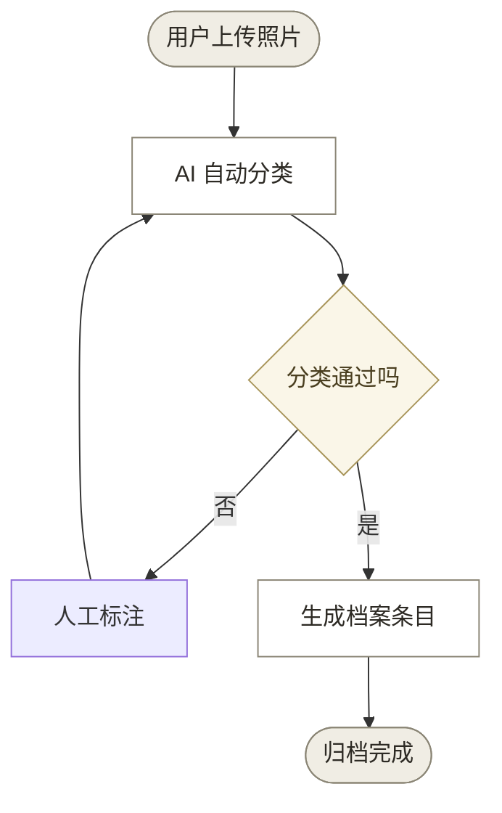

# 图表使用规范

> 适用场景：产品文档中的流程图、表格、架构图、数据图表等可视化元素。目标是"看一眼就懂"，不需要读者看图例说明书。

---

## 1. 总则

- 一张图说一件事。不要在一张图里塞多个逻辑。
- 图表必须有编号和标题。编号按文档内的出现顺序：图 1、图 2，表 1、表 2。
- 图表标题写在图表上方，格式：`**图 1：用户注册流程**` 或 `**表 1：角色权限矩阵**`
- 正文中必须引用图表：`如图 1 所示`，而不是 `见下图`

---

## 2. 表格规范

### 2.1 使用场景

适合用表格的情况：
- 多个对象在相同维度上的对比（如竞品对比、方案对比）
- 结构化的清单（如需求列表、风险清单）
- 角色与职责矩阵

不适合用表格的情况：
- 只有一个维度的简单列举（用列表）
- 大段文字描述（表格单元不应超过 3 行文字）

### 2.2 格式规范

- **列数 ≤ 6**。超过 6 列考虑拆成两张表或改用更紧凑的分类。
- **每列有明确的列名**。列名简洁（2-4 字），不用完整句子。
- **对齐方式**：文字列左对齐，数字列右对齐，短标签列居中对齐。
- **优先级列**用居中对齐的缩写：P0、P1、P2。
- **表头行加粗**，与内容行有视觉区分。

**示例**：竞品对比表

| 维度 | 竞品 A | 竞品 B | 我们的方案 |
|------|--------|--------|------------|
| 价格 | 15 万/年 | 按项目报价 | 8 万/年 |
| 离线支持 | 不支持 | 支持 | 支持 |
| AI 自动分类 | 无 | 无 | 有（准确率 > 85%） |

### 2.3 数据表格特殊要求

- 所有数字带上单位（元、%、秒、人等）
- 合计行加粗，上方用细线分隔
- 空单元格用 `—` 标注，不要留白（留白会被读成"遗漏"）

---

## 3. 流程图规范

### 3.1 使用场景

适合用流程图的情况：
- 用户操作流程（用户怎么做一件完整的事）
- 系统处理逻辑（输入 → 处理 → 输出）
- 决策树（多个条件分支）

不建议用流程图的情况：
- 简单的线性步骤（用编号列表）
- 组织架构（用树形图或文字描述）
- 概念关系（用架构图）

### 3.2 格式规范

#### 节点类型与形状约定

| 节点类型 | 形状 | 使用场景 |
|----------|------|----------|
| 开始/结束 | 圆角矩形 / 椭圆 | 流程的起点和终点 |
| 处理步骤 | 矩形 | "做了什么" |
| 判断 | 菱形 | "是否满足条件"，分支出 YES/NO |
| 数据/文档 | 平行四边形（可选） | 输入或输出的数据 |

#### 连线规范

- 主流程方向统一：从上到下，或从左到右。不要混用方向。
- 连线不加多余弯折。交叉线尽量减少。
- 判断节点分出的两条线标注：`是` / `否` 或 `通过` / `不通过`，不要只靠箭头方向让人猜。

#### 粒度控制

- 一张流程图不超过 12 个节点。超过就拆分，用一个高层流程图 + 若干子流程图。
- 节点内文字控制在 8 个字以内。用"动宾"结构：`上传照片`、`生成报告`、`校验格式`

### 3.3 绘制方式：统一用 Mermaid

流程图一律写成 Mermaid 代码块，markdown 渲染器（Typora、VSCode、导出 PDF 工具）直接解析成图。禁止用 ASCII 字符画流程图：不支持 Mermaid 的环境里它是乱的文本，支持的环境里它又不如真图。

**Mermaid 流程图示例**（含判断分支与回边，节点形状按 3.2 约定）：



书写要点：

- 节点文字含括号、斜杠等符号时用双引号包住：`A["板门(双扇)"]`
- 判断分支在连线上标注：`-->|是|`、`-->|否|`
- 回边和跨轮次动作用虚线：`-.->`
- 用户动作与系统动作用 classDef 区分底色，并在图题下注明（颜色不是唯一区分，灰度打印仍可读）
- **每条 classDef 必须同时声明 `fill`、`stroke`、`color` 三个属性**，禁止只设 fill 不设 color。理由：Mermaid 在不同渲染环境（VSCode、Typora、导出 PDF）的默认主题不一致，不设 color 会在深色主题下变成白底白字或黑底黑字。项目统一色板：白底节点 `fill:#FFFFFF,stroke:#8B8676,color:#2D2A24`，灰底节点 `fill:#F0EDE4,stroke:#8B8676,color:#2D2A24`，数据/文件节点 `fill:#E4EAF0,stroke:#7A8996,color:#1F2A33`，判断菱形 `fill:#FAF6E8,stroke:#A8955A,color:#4A3F20`
- 图中所有节点必须被一个 classDef 覆盖。不允许遗漏判断菱形或端点圆角矩形

**层级列表替代**（仅用于 3 至 5 步的简单线性流程）：

1. 用户上传照片
2. AI 自动分类（不通过 → 人工标注后重分类）
3. 生成档案条目
4. 归档完成

---

## 4. 架构图规范

### 4.1 使用场景

适合用架构图的情况：
- 系统模块划分和层级关系
- 产品功能结构（功能树）
- 数据流向

### 4.2 格式规范

- **分层清晰**：用水平分层或环形分层。每层标注名称。
- **模块边界明确**：一个方框 = 一个模块。模块之间有间距。
- **图例放在图下方**（如果图中有图标）。如果只有文字节点，不需图例。
- **不在架构图中放 UI 截图**。架构图是抽象的，截图是具体的，不要混在一张图里。

---

## 5. 数据图表规范

### 5.1 柱状图 / 条形图

- 用于比较不同类别的数值
- Y 轴从 0 开始（否则视觉上夸大了差异）
- 类别超过 6 个时考虑用条形图（横向），避免 X 轴标签旋转

### 5.2 折线图

- 用于展示变化趋势（时间序列）
- 最多放 3 条折线。超过 3 条分别放多张图或合并为"其他"
- 每条线颜色对比度足够，灰度打印也能区分

### 5.3 饼图 / 环形图

- 仅当展示"部分占整体的比例"时使用
- 分区不超过 5 个。超过 5 个的合并为"其他"并单独标注
- 不使用 3D 饼图。3D 效果扭曲了视觉面积对比

### 5.4 通用要求

- 所有坐标轴标注名称和单位：`时间（天）` 而不是 `时间`
- 数据来源写在图下方，用小字：`数据来源：国家文物局，2024`
- 估计值用虚线表示，实测值用实线表示

---

## 6. 颜色与可访问性

- 同一张图用同一色系的不同深浅表示不同类别，而不是五颜六色
- 关键信息用颜色 + 另一种形式标注（如颜色 + 标签），确保色盲读者也能获取信息
- 灰度打印测试：图打印成黑白后还能读吗？如果不能，调整颜色对比度或加文字标注

---

## 7. 图表的文字标注格式

### 7.1 编号规则

- 全文统一编号：图 1、图 2、图 3...；表 1、表 2、表 3...
- 不应出现：图 5.2、表 3-1（跨章节编号容易在增删章节后混乱）

### 7.2 标题格式

```markdown
**图 1：用户从上传到归档的完整流程**
（流程图中，灰色节点表示用户操作，白色节点表示系统自动处理）

**表 1：三种部署方案的对比**
```

### 7.3 引用方式

正文中的引用示例：
```markdown
三份方案的对比如表 1 所示。方案 B 在成本和周期上均优于方案 A。

用户完成上传后，系统将执行自动分类（见图 1 的步骤 2-4）。
```

---

## 8. 自检清单

每张图/表完成后，逐条检查：

- [ ] 有编号和标题（图 1、表 1）
- [ ] 正文中有引用
- [ ] 一张图只说一件事
- [ ] 节点/列数不超过 12 个或 6 列，超过则拆分
- [ ] 坐标轴有名称和单位
- [ ] 数据有来源标注
- [ ] 颜色不是唯一的信息区分方式
- [ ] 打印成黑白后仍可读
