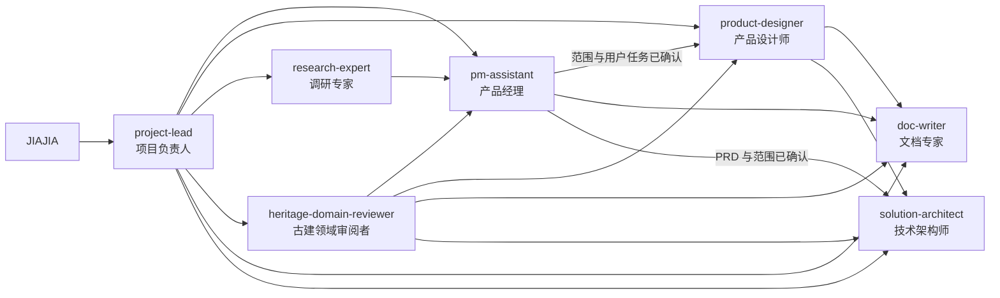

# Agent 协作体系

本项目使用一个入口和六个专业角色。Agent 定义只保留工作范围、工作原则、验收标准和禁止事项；具体方法按场景从 `.claude/skills/` 读取。

产品状态以 [pm-context](pm-context.md) 为准。角色文件不得复制产品现状，避免多个版本同时生效。

## 技能包

| skill | 何时读 |
|---|---|
| `prd-write` | 写或改 PRD、MRD、立项书 |
| `product-decision` | 定用户与场景、排优先级、算成本、审文档 |
| `product-design` | 设计或重做界面、关键流程、组件规则和实现验收 |
| `research` | 需要外部事实、竞品或行业能力上限 |
| `architecture` | PRD 确认后设计数据、模块、接口与迁移 |
| `spec-write` | 开实施单元，写规格、计划、验收 |
| `quality-check` | 改完文档或代码收口、提交前自检 |

## 团队结构

## 角色分工

| 角色 | 负责结果 | 不负责 |
|---|---|---|
| project-lead | 判断任务类型、选择角色、组织顺序、整合结果 | 专业分析和正式成文 |
| pm-assistant | 产品方向、范围、价值、优先级和决策材料 | 外部研报、正式文档、技术架构 |
| product-designer | 信息架构、用户流程、界面方案、视觉系统和实现验收 | 产品范围、专业结论和技术架构 |
| research-expert | 可追溯的市场、竞品、法规和技术能力事实 | 产品取舍和版本决策 |
| heritage-domain-reviewer | 古建术语、流程、证据和专业责任审阅 | 法定签发、商业决策、技术选型 |
| doc-writer | 将确认结论写成清晰、可执行的正式文档 | 补产品结论和技术实现 |
| solution-architect | 已确认 PRD 对应的数据、模块、接口和迁移方案 | 产品范围和未经批准的代码修改 |

## 任务路由

| 用户任务 | 首选角色 | 需要时追加 |
|---|---|---|
| 判断做不做、做什么、先做什么 | pm-assistant | research-expert、heritage-domain-reviewer |
| 设计或重做界面、关键流程与组件规范 | product-designer | pm-assistant、heritage-domain-reviewer、solution-architect |
| 审查前端视觉、交互和页面状态 | product-designer | heritage-domain-reviewer |
| 调研市场、竞品、法规、模型和前沿能力 | research-expert | pm-assistant 负责落回产品 |
| 核对古建专业表达和责任边界 | heritage-domain-reviewer | research-expert 查权威来源 |
| 整理 PRD、MRD、笔记和正式文档 | doc-writer | pm-assistant 提供确认结论 |
| 设计数据、模块、接口和重构计划 | solution-architect | pm-assistant、heritage-domain-reviewer |
| 同时包含多个阶段的复杂任务 | project-lead | 按依赖顺序选择角色 |

## 执行顺序

### 产品、设计与架构链路

产品边界先确认，设计与架构在该边界内完成各自方案。

1. 调研专家提供外部事实。
2. 古建领域审阅者核对专业边界。
3. 产品经理结合 `pm-context` 做范围与优先级判断。
4. JIAJIA 确认方向和范围。
5. 文档专家形成正式 PRD 或其他文档。
6. 涉及界面时，产品设计师形成关键流程、代表页面、组件规则和设计验收条件。
7. 技术架构师根据已确认的 PRD 和必要的设计输入给出架构与迁移方案。
8. 架构方案触发 `pm-context` 确认门槛时先取得确认，其余方案直接进入实施单元。

各任务按前置条件选择必要环节。整理已确认笔记只需文档专家；核对一个专业术语只需古建领域审阅者；不改变界面的技术任务可跳过产品设计。

### 实施链路

实施开工固定读取三层入口和当前单元三件套，详细文档只按其中的引用加载。

| 层级 | 固定输入 |
|---|---|
| mission | [核心 PRD](../../文档/01_产品/01_核心PRD.md) 第 0 节项目任务摘要 |
| tech-stack | [技术架构](../../文档/02_技术/01_技术架构.md) 第 0 节工程约束摘要 |
| roadmap | [路线图](../../文档/04_实施单元/00_路线图.md) 当前阶段行 |
| 当前单元 | `规格.md`、`计划.md`、`验收.md` |

一个实施单元一个目录，放在 `文档/04_实施单元/`。模板与必填项见 `spec-write` 技能包。

七步顺序：

1. 核对输入。读取固定入口与三件套，检查范围、依赖和验收是否一致。
2. 处理缺口。只有产品边界、架构门槛或验收目标缺失时提问；其余信息按权威文档执行。
3. 写三件套。验收条件在开工前写定。
4. 复述。执行方只凭固定入口与三件套说明任务和完成条件，缺失内容补回文件。
5. 实施。每完成一个任务组运行该组验证。
6. 收口。运行 `node .claude/skills/quality-check/scripts/run-all.mjs --full`，必须修复项清零。
7. 复盘并关闭。按复盘清单更新相关文档；验收全部通过且未触发确认门槛时，直接在路线图更新状态。单元留在实施区，阶段收尾时整批移入 `文档/99_历史归档/`。

建单元的门槛：

- 跨多次会话、有验收门槛、需要产出证据的工作建单元。
- 一次会话做完且不产出证据的改动不建单元，直接做，在路线图留一行。

规则：

- 规格只引用 PRD 的功能编号，不新设需求。发现 PRD 缺内容时回去改 PRD，不在单元内另立一套。
- 事后补写的验收不构成验收。
- 实施中发现规格与代码现状冲突，先停下说明，不在代码里绕开规格另做一套，也不改规格迁就实现。
- 证据仍归 `文档/05_验证证据/`，单元内只留指针，因为部分证据目录同时是演示包的构建输入。

进度与阶段顺序以路线图为准，`pm-context` 只留指针与待决策事项。

## 委托格式

项目负责人给专业角色的任务包含五项：

1. 目标：需要回答或完成什么。
2. 输入：必须读取哪些文件和事实。
3. 输出：需要返回的结构和详细程度。
4. 边界：不得决定、修改或假设什么。
5. 验收：怎样判断任务完成。

## 决策与写入权限

决策权限按 `pm-context` 的确认规则执行，已确认范围内的日常实施无需逐项上报。

- JIAJIA 决定产品方向、范围、重大投入和确认门槛内的外部动作。
- 产品经理在产品边界确认后更新 `pm-context.md`。
- 产品设计师在已确认范围内更新界面方案、组件规则和设计验收记录。
- 文档专家只写已经确认的结论。
- 技术架构师负责架构方案，代码修改通过实施单元执行。
- 古建领域审阅者只能提出专业问题和验证要求，不能代替真实负责人签发。

## 上下文控制

上下文按固定入口和引用逐层加载。

- 实施任务先读 PRD 第 0 节、技术架构第 0 节、路线图当前阶段行和当前单元三件套。
- 其他任务只读取当前角色定义、`pm-context`、必要的技能包和直接涉及的权威文档。
- 角色定义不得复制模板、项目状态或具体业务规则。
- 角色定义随认知清晰而收缩，不靠追加规则修正行为。产出不符预期时，先反查角色定义、协作流程、输入文档三者中哪一处不准，再改上游。
- 确定性规则写入程序或检查文件，不堆进 Agent 提示词。
- 角色出现偏离时，重新声明角色和当前任务；长期对话内容过多时新开会话。

## 团队维护

`.claude` 是项目规则、角色、上下文和 skill 的唯一维护源。`CLAUDE.md`、`AGENTS.md`、`.codex/agents/` 与 `.agents/skills/` 由 `node .claude/scripts/sync-agent-adapters.mjs` 生成。

每次辅导或重大返工后检查三类问题：有任务无人负责、多个角色重复负责、角色定义无法完成验收。只有出现稳定且独立的新职责时才新增 Agent；一次性问题写入场景参考文件，不新增角色。
