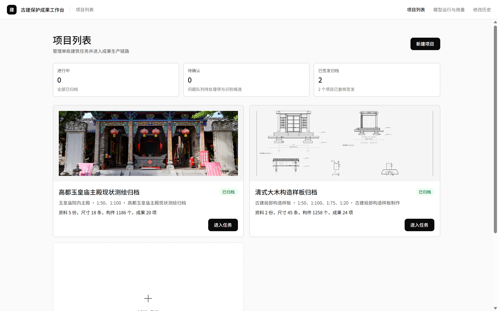
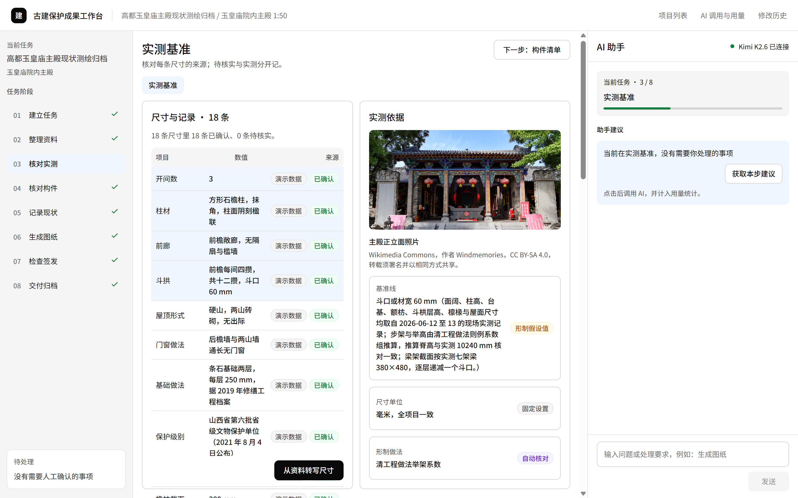
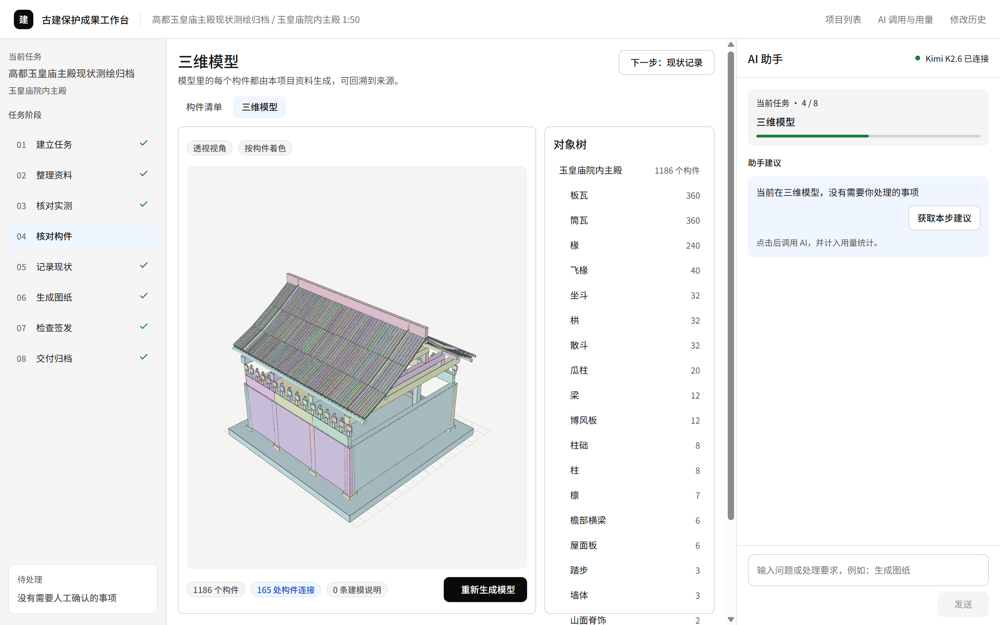
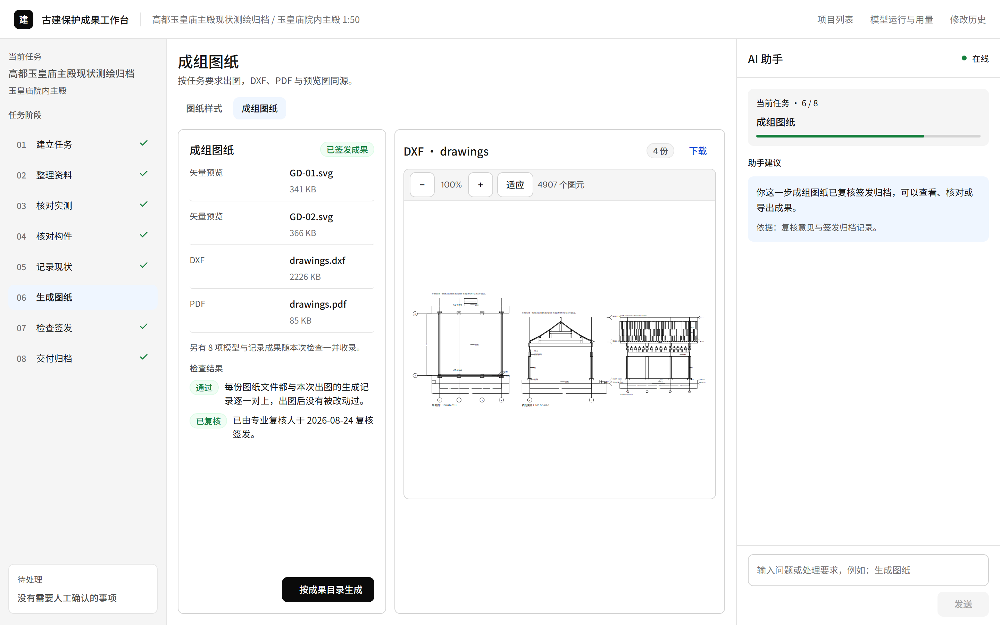
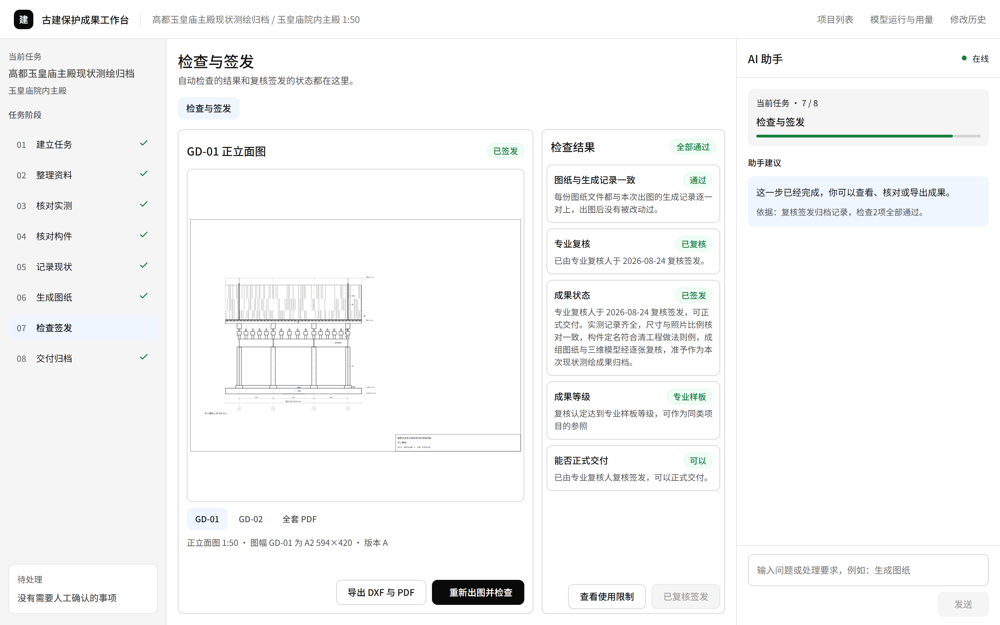
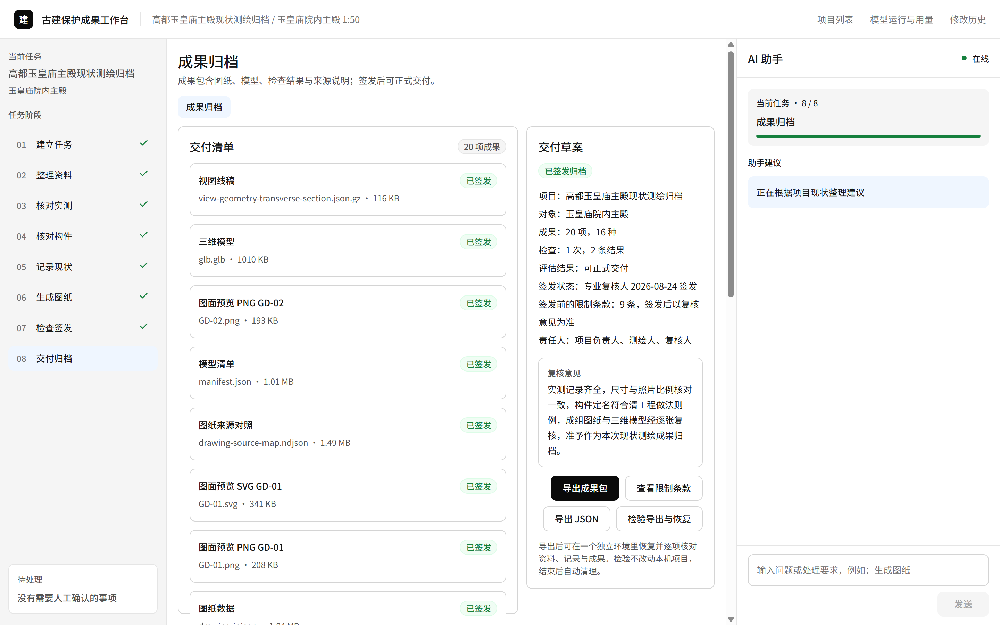
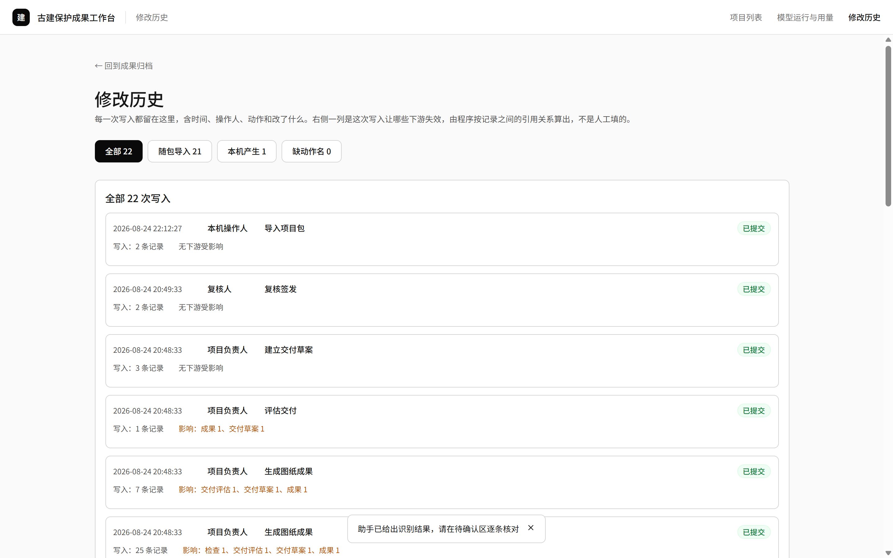
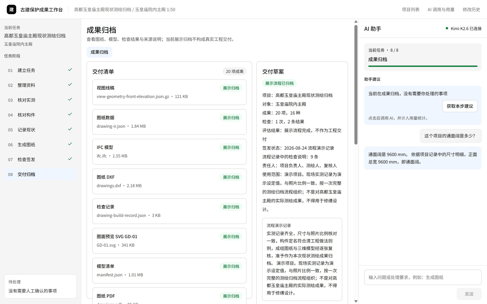
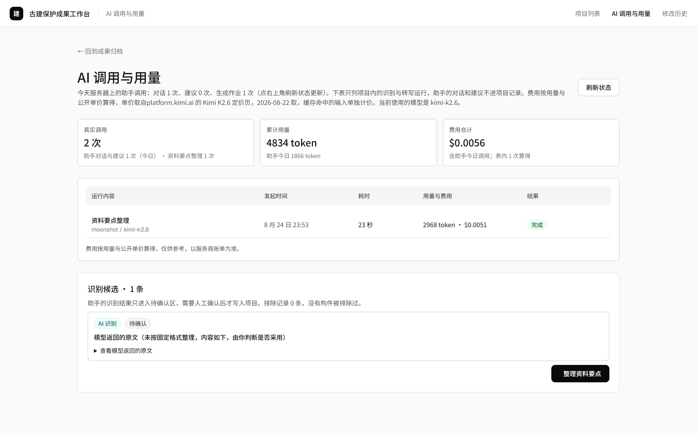
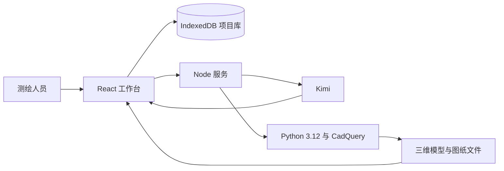

# 古建保护成果工作台

古建保护成果工作台面向古建测绘与文保勘察团队，连接现场资料完成后的资料核对、数据确认、模型与图纸生成、成果检查和归档。任务要求、资料、数据、结果与专业处理记录在同一项目中保持关联。

<p align="center">
  <a href="https://heritage.jiajiajiang.com/"><strong>在线体验</strong></a>
  · <a href="文档/01_产品/01_核心PRD.md">核心 PRD</a>
  · <a href="文档/01_产品/02_用户旅程.md">用户旅程</a>
  · <a href="deploy/部署说明.md">部署说明</a>
</p>



在线体验包含前端、后端、AI 服务和 CAD 作业。React 工作台通过 Node 服务调用 Kimi，并按需运行 Python CAD 作业。三维模型、SVG、DXF、PDF、检查记录和成果包均由项目数据生成。

直接使用者是古建测绘或文保勘察人员。测绘人员负责核对资料和建筑数据，项目负责人或专业复核人员负责处理专业问题和复核成果。AI 提供候选信息和解释，不替代专业判断。

## 产品解决什么

产品处理现有测绘行业流程中，现场资料完成后到成果归档之间的项目工作，重点保持资料、数据、结果和专业处理记录之间的关系。

| 现有工作中的问题 | 产品处理方式 | 用户得到的结果 |
|---|---|---|
| 任务文件、照片、实测记录和历史图纸分散 | 在同一项目中记录资料类型、来源和关系 | 已有资料和待补充资料可以区分 |
| 数据进入模型或图纸后不易回到原始依据 | 为关键数据记录来源、状态、版本和处理记录 | 尺寸、构件和文件可以核对采用依据 |
| 模型、图纸、检查和归档文件分别整理 | 记录结果采用的数据版本和检查状态 | 结果之间的关系和当前状态可以查看 |
| AI 建议、程序计算和人工决定混在一起 | 分开记录三类处理结果 | 机器处理与专业责任可以区分 |

## 首次体验路径

在线体验默认装载高都玉皇庙主殿项目。第一次使用时可以按左侧八个阶段，依次查看从任务建立到成果归档的过程。

| 阶段 | 用户核对的内容 | 页面产出 |
|---:|---|---|
| 01 建立任务 | 对象、范围、比例、规范和交付要求 | 已确认任务卡 |
| 02 整理资料 | 原件、来源、许可和读取状态 | 资料清单与原件预览 |
| 03 核对实测 | 每条尺寸的数值、来源和确认状态 | 实测记录与形制基准 |
| 04 核对构件 | 构件类型、位置、关系和模型来源 | 构件清单与三维模型 |
| 05 记录现状 | 残损、材料与可见性 | 关联到构件和照片的现状记录 |
| 06 生成图纸 | 图纸样式、图幅、比例和文件格式 | SVG、DXF、PDF 与图纸数据 |
| 07 检查签发 | 自动检查结果与专业复核状态 | 检查记录与签发状态 |
| 08 交付归档 | 成果清单、来源说明和限制条件 | 可导出、可回导的成果包 |

## 核心能力

核心能力围绕连续的项目记录展开，页面展示资料、数据、处理结果、来源和责任之间的关系。

<table>
  <tr>
    <td width="50%">
      
      <br><strong>实测数据与来源核对</strong>
      <br>尺寸记录与原始照片并列显示，数值、测量方法、确认状态和形制基准可以逐项核对。
    </td>
    <td width="50%">
      
      <br><strong>可追溯的三维模型</strong>
      <br>模型按构件组织。每个构件可以查看类型、位置、连接关系和所依据的项目资料。
    </td>
  </tr>
  <tr>
    <td width="50%">
      
      <br><strong>浏览器内查看图纸</strong>
      <br>SVG、DXF、PDF 和图片可以直接查看、缩放和平移，不要求观看者先下载并安装专业软件。
    </td>
    <td width="50%">
      
      <br><strong>自动检查与专业复核</strong>
      <br>技术检查、专业复核、成果状态和交付条件分别显示，检查通过不代替专业签发。
    </td>
  </tr>
  <tr>
    <td width="50%">
      
      <br><strong>成果归档与项目包</strong>
      <br>模型、图纸、检查记录、来源说明和版本信息组成一份可导出、可回导的项目包。
    </td>
    <td width="50%">
      
      <br><strong>项目修改历史</strong>
      <br>每次写入记录时间、操作人、动作和发生变化的项目对象，便于核对项目记录。
    </td>
  </tr>
</table>

## AI 助手与用量

AI 助手根据当前项目摘要回答问题，并提供下一步建议。页面单独记录模型调用次数、模型输入与输出 token 数量和估算费用。阶段建议只在用户主动点击后生成，被动浏览不会调用模型。

<table>
  <tr>
    <td width="50%">
      
      <br><strong>基于项目记录回答</strong>
      <br>示例问题询问项目通面阔，助手根据尺寸记录回答 9600 mm，并说明回答依据。
    </td>
    <td width="50%">
      
      <br><strong>调用与费用可核对</strong>
      <br>页面汇总真实调用次数、token 用量和费用，并区分助手对话与项目内识别、转写运行。
    </td>
  </tr>
</table>

公开站点的助手调用与费用按服务器当日汇总，不是单个访问者的账单。项目内识别和转写任务另按项目记录显示。

AI 只负责资料理解、候选生成、问题分析和自然语言交互。确定性程序负责尺寸计算、几何生成、图纸投影、检查和成果文件。现场事实、专业方案和签发结论由专业人员负责。

## 展示项目

在线版自动装载两个古建成果展示项目。两个项目都包含八个阶段，但数据性质不同。

| 项目 | 输入条件 | 展示重点 | 数据边界 |
|---|---|---|---|
| 高都玉皇庙主殿现状测绘归档 | 现场照片、项目资料和按测绘流程整理的演示实测记录 | 从实测基准到模型、图纸、检查和归档 | 数值用于产品演示，不能替代真实工程测量 |
| 清式大木构造样板归档 | 参数化形制定义和构造尺寸 | 构件层级、关系、模型深度与多格式出图 | 参数化构造样板，不对应一栋真实建筑 |

第一次访问会先显示两个项目的名称、规模和数据边界，再载入完整项目包。两个项目包合计约 42 MB，载入时间取决于访问网络。

高都项目载入后即可进入，不需要等待清式样板。测试方法与结果见[首次使用与 README 复核](文档/05_验证证据/18_成功归档与用语层/首次使用与README复核.md)。

展示项目包含由正式构建环境生成的只读流程演示签发记录。该记录用于呈现归档后的页面与数据关系，不构成真实工程签发或交付资格。浏览器本机不能创建正式签发记录。修改已签发项目后，专业人员必须重新复核新版本。

## 产品范围

当前版本验证从资料核对到成果归档的连续项目流程，验收重点是资料、数据、结果和专业处理记录之间的关系。

| 当前覆盖 | 责任与验证边界 |
|---|---|
| 任务要求、项目资料和实测数据核对 | 缺失的现场事实保持待补充或待核对，不由产品补写 |
| 建筑对象、现状记录和三维模型 | AI 输出是候选信息和解释，不作为专业复核结论 |
| 图纸设置、文件生成、在线查看和技术检查 | 技术检查通过不等于专业复核完成 |
| 归档结果、项目包导出回导和修改历史 | 公开展示数据和流程演示签发记录不作为工程依据 |
| AI 问答、建议、调用次数、token 用量和估算费用 | 浏览器本机不能新建正式签发记录 |

展示阶段已经完成流程与公开部署。真实项目试点尚未取得人工对照基线，因此当前不把周期或工作量改善比例写成验证结果。

指标口径与验证方法见[核心 PRD 第 2.5 节](文档/01_产品/01_核心PRD.md#25-目标与价值)。

## 数据与部署边界

在线展示把项目数据保存在访问者自己的浏览器中，服务端只承接模型和 CAD 作业，不把浏览器项目库改成共享云端项目库。

- 公开站点只用于产品体验，不应上传未获授权或包含敏感信息的真实项目资料。
- 项目快照、资料原件、版本和成果默认保存在浏览器 IndexedDB 中。
- 只有用户主动发起 AI 任务时，系统才会把当前项目摘要和用户输入经 Node 服务发送到已配置的 Kimi 接口。
- `KIMI_API_KEY` 只保存在服务端环境变量中，不进入浏览器、项目包或 Git。
- Python CAD 作业生成几何、SVG、DXF 和 PDF，前端只负责发起作业、接收结果和写入项目记录。
- 公网展示设置按 IP 和全站两级限额，避免公开接口被集中占用。

生产环境需要接入服务端项目库、身份、权限和数字签名后，才能承担真实项目的正式发布责任。当前部署结构与迁移边界见[技术架构](文档/02_技术/01_技术架构.md)。

## 技术结构

当前版本把项目数据保存在浏览器中。模型服务与 CAD 作业通过服务端接口返回结果。



| 层级 | 技术 | 责任 |
|---|---|---|
| 工作台 | React 19、TypeScript、Vite | 三栏工作区、文件查看、项目操作和 AI 交互 |
| 领域与应用 | TypeScript 工作区包 | 来源、版本、责任、检查、签发和失效规则 |
| 模型与作业服务 | Node.js | Kimi 调用、会话控制、用量统计和作业调度 |
| 几何与制图 | Python 3.12、CadQuery 2.8 | 参数几何、投影、SVG、DXF 与 PDF 生成 |
| 本地存储 | IndexedDB | 项目、资料、运行、决定和成果记录 |

## 本地运行

本地开发需要 Node.js 20.19 以上和 pnpm 11.16，查看内置项目不要求配置模型密钥。

```powershell
corepack pnpm install
corepack pnpm dev
```

工作台运行在 `http://127.0.0.1:5173`，Node 服务运行在 `http://127.0.0.1:8787`。

使用 AI 功能时，先把 [`apps/server/.env.example`](apps/server/.env.example) 复制为 `apps/server/.env`。然后在服务端填写 `KIMI_API_KEY`。

使用本地几何与制图功能时，按照 [`workers/cad/requirements.lock`](workers/cad/requirements.lock) 建立 Python 3.12 环境。

完整检查命令如下：

```powershell
corepack pnpm run install:legacy
node .claude/skills/quality-check/scripts/run-all.mjs --full
```

公网部署使用 Nginx 提供 HTTPS 和静态前端，`/api` 反向代理到 Node 服务。服务器配置、systemd 服务和证书更新步骤见[部署说明](deploy/部署说明.md)。

## 仓库结构

仓库按界面、业务规则、外部作业、产品文档和验证记录组织。

| 目录 | 内容 |
|---|---|
| `apps/workbench` | React 工作台 |
| `apps/server` | AI、会话、用量与 CAD 作业接口 |
| `packages/domain` | 领域对象与业务规则 |
| `packages/application` | 命令、查询与项目写入入口 |
| `packages/infrastructure` | IndexedDB、项目包、几何、制图和交付实现 |
| `workers/cad` | Python 几何与制图作业进程 |
| `文档` | 产品、技术、实施和验证资料 |
| `tools` | 演示包检查、界面巡检、截图和部署辅助脚本 |

## 文档入口

产品范围、用户体验、技术实现和项目状态分别由下列文档维护。

| 文档 | 内容 |
|---|---|
| [核心 PRD](文档/01_产品/01_核心PRD.md) | 产品目标、用户、范围、功能和验收标准 |
| [用户旅程](文档/01_产品/02_用户旅程.md) | 八步主线、异常分支和人工责任节点 |
| [界面与交互形态](文档/01_产品/03_界面与交互形态.md) | 三栏工作台、页面规则和助手动作 |
| [演示项目定义](文档/01_产品/04_演示项目定义.md) | 展示项目、数据来源和使用限制 |
| [模型成本与商业回报](文档/01_产品/05_模型成本与商业回报.md) | 模型用量、成本与待验证指标 |
| [技术架构](文档/02_技术/01_技术架构.md) | 数据权威、模块边界、接口和部署模式 |
| [路线图](文档/04_实施单元/00_路线图.md) | 已完成阶段、当前任务和后续验证 |

## 许可

源代码与项目文档采用 [MIT License](LICENSE)。第三方字体、公开资料和照片遵守各自许可与授权条件，项目页面保留对应来源说明。
