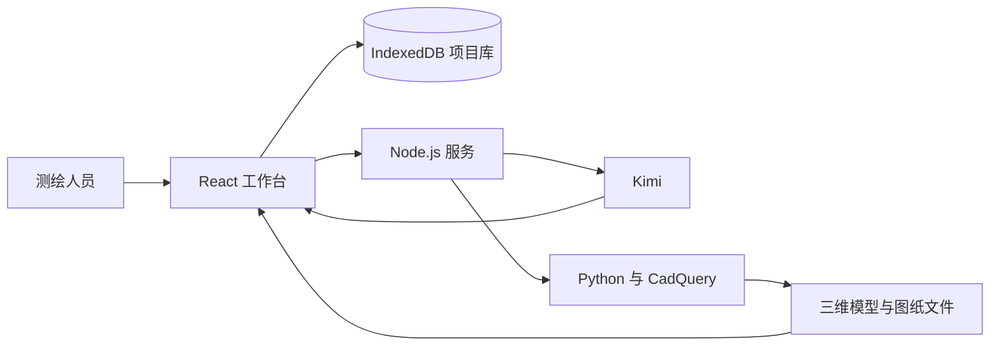

# 古建保护成果工作台

古建保护成果工作台面向古建测绘与文保勘察团队，连接现场资料完成后的资料核对、实测确认、模型与图纸生成、成果检查和归档。产品让任务要求、项目资料、建筑数据、结果文件和专业处理记录在同一项目中保持关联。

<p align="center">
  <a href="https://heritage.jiajiajiang.com/"><strong>进入完整产品体验</strong></a>
  · <a href="文档/01_产品/01_核心PRD.md">核心 PRD</a>
  · <a href="文档/01_产品/02_用户旅程.md">用户旅程</a>
  · <a href="deploy/部署说明.md">部署说明</a>
</p>


直接使用者是古建测绘或文保勘察人员。项目负责人和专业复核人员负责处理专业问题、核对成果与确认适用范围。

## 用户与问题

产品处理现有测绘行业流程中，现场资料完成后到成果归档之间缺少连续项目记录的问题。

| 现有工作中的问题 | 产品处理方式 | 用户得到的结果 |
|---|---|---|
| 任务文件、照片、实测记录和历史图纸分散 | 在同一项目中记录资料类型、来源和关系 | 已有资料和待补充资料可以区分 |
| 数据进入模型或图纸后不易回到原始依据 | 为关键数据记录来源、状态、版本和处理记录 | 尺寸、构件和文件可以核对采用依据 |
| 模型、图纸、检查和归档文件分别整理 | 记录结果采用的数据版本和检查状态 | 结果之间的关系和当前状态可以查看 |

## 产品方案

产品用四个连续模块承接资料核对到成果归档的项目过程。

| 模块 | 用户任务 | 产品结果 |
|---|---|---|
| 项目资料与实测核对 | 查看任务要求，整理资料，核对实测数据和来源 | 资料清单、实测记录和确认状态 |
| 建筑数据与三维模型 | 核对构件、空间关系、现状记录和三维位置 | 建筑对象记录、现状记录和模型版本 |
| 图纸与成果检查 | 设置图纸要求，生成文件，查看技术检查结果 | SVG、DXF、PDF、图片和检查记录 |
| 归档成果与项目记录 | 核对文件、版本、复核状态和使用限制 | 可查看、可导出和可回导的项目包 |

当前界面把四个模块展开为八个任务阶段。完整过程与异常分支见[用户旅程](文档/01_产品/02_用户旅程.md)。

## 核心能力

核心能力围绕资料、数据、模型、图纸和归档结果之间的关系展开。

<table>
  <tr>
    <td width="50%">
      
      <br><strong>实测数据与来源核对</strong>
      <br>尺寸记录与原始资料并列显示，数值、测量方法、来源和确认状态可以逐项核对。
    </td>
    <td width="50%">
      
      <br><strong>构件与三维模型</strong>
      <br>模型按构件组织，构件类型、位置、连接关系和采用的项目资料可以查看。
    </td>
  </tr>
  <tr>
    <td width="50%">
      
      <br><strong>浏览器内查看图纸</strong>
      <br>SVG、DXF、PDF 和图片可以直接查看、缩放和平移，无需先下载专业软件。
    </td>
    <td width="50%">
      
      <br><strong>成果检查与专业复核</strong>
      <br>技术检查、专业复核、成果状态和适用范围分别显示。
    </td>
  </tr>
  <tr>
    <td width="50%">
      
      <br><strong>成果归档与项目包</strong>
      <br>模型、图纸、检查记录、来源说明和版本信息组成可导出、可回导的项目包。
    </td>
    <td width="50%">
      
      <br><strong>基于项目记录回答问题</strong>
      <br>助手根据当前项目中的资料、尺寸和处理状态回答问题，并提供下一步建议。
    </td>
  </tr>
</table>

### AI 调用与费用

AI 调用与用量页面记录真实调用次数、输入与输出 token 数量和估算费用。


阶段建议只在用户主动获取时调用模型。公开站点显示服务器当日汇总，不是单个访问者的账单。

## AI、程序与专业人员的责任

产品把机器建议、确定性计算和专业决定分开记录。

| 责任方 | 处理内容 | 责任边界 |
|---|---|---|
| AI | 理解资料、识别候选信息、回答项目问题 | 不生成现场信息，不作专业复核结论 |
| 确定性程序 | 计算、生成模型与文件、运行技术检查 | 不选择专业方案，不完成责任签发 |
| 专业人员 | 确认现场信息、处理专业问题、完成复核 | 对数据、专业判断和适用范围负责 |

## 在线体验与展示项目

在线版装载两个数据性质不同的中国古建展示项目，用于查看完整页面、生成文件、AI 问答和归档结果。

| 项目 | 展示重点 | 数据边界 |
|---|---|---|
| 高都玉皇庙主殿现状测绘归档 | 从照片和演示实测记录到模型、图纸、检查与归档 | 数值用于产品演示，不能替代真实工程测量 |
| 清式大木构造样板归档 | 构件层级、连接关系、参数化构造和多格式结果 | 不对应真实建筑，不作为专业参照标准 |

AI 建议与问答由真实模型生成，用量来自真实调用。展示项目携带只读流程演示签发记录，用于呈现归档状态，不构成真实工程签发。浏览器本机不能新建正式签发记录。

公开站点只用于产品体验。请勿上传未获授权或包含敏感信息的真实项目资料。展示项目的来源和限制见[演示项目定义](文档/01_产品/04_演示项目定义.md)。

## 当前验证范围

当前版本验证从资料核对到成果归档的连续项目流程，不把展示结果表述为真实项目成效。

| 已验证内容 | 当前结果 |
|---|---|
| 任务、资料和实测核对 | 八个任务阶段均有业务内容、操作入口和运行结果 |
| 模型、图纸、检查和归档 | 图片、SVG、DXF、PDF、三维模型、检查结果和归档文件可以查看 |
| 项目包与修改记录 | 项目包可以导出和回导，项目写入进入修改历史 |
| AI 问答与用量 | 回答基于当前项目记录，调用次数、token 用量和估算费用可以查看 |

真实项目试点尚未取得人工对照基线，因此当前不把周期或工作量改善比例写成验证结果。产品范围和验证方法见[核心 PRD](文档/01_产品/01_核心PRD.md)。

## 技术与运行

在线体验包含前端、后端、AI 服务和 CAD 作业，项目数据默认保存在访问者自己的浏览器中。



React 工作台负责项目操作和文件查看，TypeScript 工作区包维护业务规则，Node.js 服务承接 Kimi 调用与 CAD 作业，Python 和 CadQuery 生成模型与图纸。项目记录保存在 IndexedDB 中。

用户主动发起 AI 任务时，系统才发送项目摘要和用户输入。`KIMI_API_KEY` 只保存在服务端。

### 本地运行

本地开发需要 Node.js 20.19 以上和 pnpm 11.16。查看内置项目不要求配置模型密钥。

```powershell
corepack pnpm install
corepack pnpm dev
```

工作台运行在 `http://127.0.0.1:5173`，Node.js 服务运行在 `http://127.0.0.1:8787`。

使用 AI 功能时，将 [`apps/server/.env.example`](apps/server/.env.example) 复制为 `apps/server/.env`，并在服务端填写 `KIMI_API_KEY`。使用本地几何与制图功能时，按照 [`workers/cad/requirements.lock`](workers/cad/requirements.lock)建立 Python 3.12 环境。

完整检查命令：

```powershell
corepack pnpm run install:legacy
node .claude/skills/quality-check/scripts/run-all.mjs --full
```

公网部署使用 Nginx 提供 HTTPS 和静态前端，`/api` 反向代理到 Node.js 服务。服务器配置和更新步骤见[部署说明](deploy/部署说明.md)。

代码位于 `apps`、`packages` 和 `workers`，产品与技术资料位于 `文档`，检查和部署脚本位于 `tools`。

## 文档入口

产品范围、用户体验、技术实现和项目状态由下列文档维护。

| 文档 | 内容 |
|---|---|
| [核心 PRD](文档/01_产品/01_核心PRD.md) | 产品目标、用户、范围、功能和验收标准 |
| [用户旅程](文档/01_产品/02_用户旅程.md) | 八阶段主线、异常分支和专业责任 |
| [界面与交互形态](文档/01_产品/03_界面与交互形态.md) | 三栏工作台、页面规则和助手动作 |
| [演示项目定义](文档/01_产品/04_演示项目定义.md) | 展示项目、数据来源和使用限制 |
| [模型成本与商业回报](文档/01_产品/05_模型成本与商业回报.md) | 模型用量、成本和待验证指标 |
| [技术架构](文档/02_技术/01_技术架构.md) | 数据权威、模块边界、接口和部署方式 |
| [路线图](文档/04_实施单元/00_路线图.md) | 已完成阶段、当前任务和后续验证 |

## 许可

源代码与项目文档采用 [MIT License](LICENSE)。第三方字体、公开资料和照片遵守各自许可与授权条件，项目页面保留对应来源说明。
