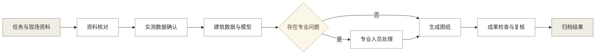
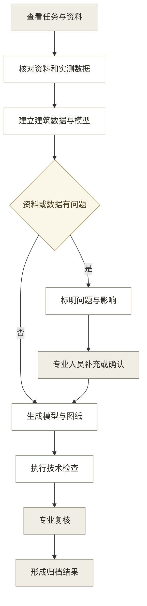
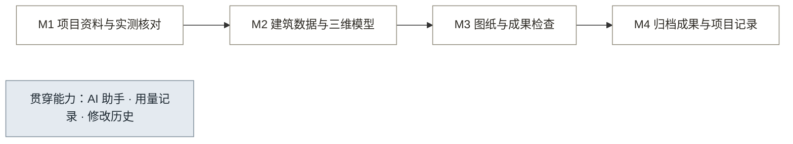

# 01 · 核心 PRD：古建保护成果工作台 v3.0

## 0. 项目任务摘要

本产品面向古建测绘与文保勘察团队，连接现场资料完成后的资料核对、数据确认、模型与图纸生成、成果检查和归档。

| 项目 | 现行口径 |
|---|---|
| 第一用户 | 负责古建测绘或文保勘察项目的专业人员 |
| 核心场景 | 现场资料完成后，专业人员需要把任务要求、照片、实测记录和历史图纸整理为可核对的建筑数据、模型、图纸和归档结果 |
| 产品目标 | 让资料、数据、结果和专业处理记录在同一项目中保持关联，使关键结果可以回到采用的资料、数据版本和处理记录 |
| 责任划分 | AI 理解资料、提出候选信息并回答项目问题；程序计算、生成文件并执行技术检查；专业人员确认现场信息、处理专业问题并完成复核 |
| 当前验证 | 公开环境用于验证完整流程、文件查看、AI 问答和用量记录；展示内容不代表真实工程成果 |

## 1. 文档信息

v3.0 重新明确目标用户、核心场景和专业责任，并删除与当前产品判断无关的行业数据、历史决策过程和实现细节。

**修订记录**

| 版本 | 日期 | 修订内容 |
|---|---|---|
| v2.0 至 v2.5 | 2026-08-17 至 2026-08-26 | 建立五模块、十八项功能和展示验收口径 |
| v3.0 | 2026-08-26 | 按现有测绘行业流程重写产品目标、用户、流程和范围；功能收敛为四个模块与十三个功能组 |

### 1.1 需求摘要

古建保护成果工作台承接现场资料完成后到成果归档之间的项目工作。产品把任务要求、照片、实测记录、历史图纸、建筑数据、三维模型、测绘图纸、检查结果和归档文件放在一条可核对的记录中。

AI 用于理解资料、识别候选信息、解释问题和回答项目问题。尺寸计算、模型与文件生成、技术检查由确定性程序完成；现场信息确认、专业问题处理和成果复核由专业人员完成。

### 1.2 流程概览

产品从任务和现场资料开始，经过资料与实测核对、建筑数据与模型整理、图纸生成和成果检查，最后形成归档结果。

**核心业务：**

1. **资料与数据连续关联**：任务要求、现场资料、实测数据和专业处理记录在同一项目中相互关联。
2. **关键结果可以回查**：尺寸、构件、模型、图纸和归档文件记录采用的资料、数据版本和确认状态。
3. **专业问题有明确去处**：资料不足、数据冲突和专业判断分别进入待补充、待核对或待复核状态，不用默认值补齐。
4. **归档内容可以核对**：归档结果同时包含文件、版本、来源说明、检查结果和适用限制。

## 2. 需求背景

本产品处理的是现有测绘行业流程中，现场资料完成后到成果归档之间缺少连续项目记录的问题。

### 2.1 愿景

让古建测绘与文保勘察团队沿一条可核对的项目记录，完成建筑数据、模型、图纸和归档结果的整理与复核。

### 2.2 目标用户

第一用户是古建测绘与文保勘察团队中的专业人员，项目负责人和成果接收单位分别承担复核与接收责任。

| 角色 | 主要工作 | 产品关系 |
|---|---|---|
| 测绘或文保勘察人员 | 整理资料、核对实测数据、检查建筑对象、查看模型与图纸 | 当前直接使用者 |
| 项目负责人或专业复核人 | 处理专业问题、核对检查结果、确认成果适用范围 | 当前责任角色 |
| 委托方或成果接收单位 | 按自身流程核对文件完整性和使用限制 | 接收产品输出，不是当前直接操作角色 |

### 2.3 现状与问题

现有测绘行业流程中的主要问题，是任务要求、资料、数据和结果分别保存在不同文件和工具中，项目关系依赖人工维持。

- **资料分散**：任务文件、现场照片、实测记录和历史图纸分别存放，资料之间缺少稳定的对应关系。
- **数据依据分离**：尺寸、构件和现状记录进入表格、模型或图纸后，原始资料与确认过程不易一并查看。
- **结果分别整理**：模型、图纸、检查记录和归档文件各自形成，使用的数据版本和处理状态不易核对。
- **专业责任分散**：程序计算、AI 建议和人工决定混在记录中，后续人员难以判断哪些内容已经过专业确认。

**结果**：专业人员需要在多个文件和工具之间核对同一项目，难以快速看清某项结果采用了哪些资料、数据版本和专业处理记录。

**根因**：现有工具大多分别服务现场采集、绘图、建模或档案接收，缺少贯穿现场资料完成后到成果归档的项目记录。

### 2.4 行业趋势

行业正在积累更多数字化照片、点云、模型和图纸，但自动识别仍不能替代专业核对，因此产品需要同时支持机器处理、程序校验和人工确认。

行业事实与采购情况见[目标用户调研与权重打分](../99_历史归档/01_文档历史版本/重分类归档_2026-08-16/00_目标用户调研与权重打分.md)，AI 与制图能力上限见[AI 与制图能力边界](../06_研究底稿/01_AI与制图能力边界.md)。本 PRD 只保留对产品判断有直接影响的结论。

### 2.5 目标与价值

v1.0 的目标是验证现场资料完成后到成果归档的连续工作流程，并证明关键结果能够回到采用的资料、数据版本和专业处理记录。

**产品价值：**

- **项目关系清楚**：专业人员可以在同一项目中核对任务、资料、数据、模型、图纸、检查和归档结果之间的关系。
- **结果依据可查**：关键尺寸、构件和文件能够显示来源、状态、版本和处理记录。
- **责任划分明确**：AI 建议、程序计算和专业决定分别记录，避免把机器输出误认为专业结论。
- **归档边界可见**：文件完整性、复核状态和使用限制随归档结果一并呈现。

**当前公开验证：**

| 验证项 | 验收口径 | 依据 |
|---|---|---|
| 流程覆盖 | 当前定义的八个任务阶段均有业务内容、操作入口和运行结果 | [演示项目定义](04_演示项目定义.md) 第 2 节与第 6 节 |
| 文件查看 | 图片、SVG、DXF、PDF 和三维模型可在页面内查看 | [演示项目定义](04_演示项目定义.md) 第 2 节 |
| AI 透明度 | 真实调用显示次数、token 用量和估算费用 | [演示项目定义](04_演示项目定义.md) 第 7 节 |
| 展示边界 | 演示数值、责任角色和只读复核记录不表述为真实工程事实 | [演示项目定义](04_演示项目定义.md) 第 1 节与第 5 节 |

真实项目试点前，需要先记录资料核对、成果检查和问题定位的人工基线。没有基线的数据不设改善比例，也不作为当前版本的验收结论。

### 2.6 市场和竞品分析

根据现有公开调研，相关方案分别覆盖现场采集、数字化服务、遗产资产管理或单项算法，现场资料完成后到成果归档的连续工作流程仍缺少完整产品形态。

| 类别 | 主要对象 | 已覆盖内容 | 当前缺口 | 判断 |
|---|---|---|---|---|
| 测绘与数字化服务 | 单个项目 | 采集、重建、模型或文件交付 | 项目结束后的资料关系和处理记录不连续 | 已验证项目需求，交付方式以项目制为主 |
| 遗产资产管理平台 | 已接收的遗产记录 | 台账、词表、查询和管理 | 不承接成果归档前的资料核对、数据确认和图纸检查 | 与本产品处于流程两端 |
| 研究与开源工具 | 单项技术任务 | 点云处理、识别、模型转换 | 缺少完整项目流程和专业责任记录 | 可作为能力组件，不能直接替代产品 |

**结论**：本产品不与现场采集工具或档案管理平台争夺同一环节，重点连接资料核对、数据确认、模型与图纸结果、成果检查和归档记录。

竞品与技术来源见[目标用户调研与权重打分](../99_历史归档/01_文档历史版本/重分类归档_2026-08-16/00_目标用户调研与权重打分.md)、[AI 与制图能力边界](../06_研究底稿/01_AI与制图能力边界.md)和[开源技术借鉴](../06_研究底稿/02_开源技术借鉴.md)。

### 2.7 旧版本

v2.5 及更早版本保留在 Git 历史和 `../99_历史归档/` 中。v3.0 继续沿用 F01 至 F18 编号，便于核对既有实施记录，但不再沿用旧五模块和旧定位说明。

## 3. 业务流程

业务流程只在资料不足、数据冲突、专业判断和成果复核时要求人工介入，其余计算、文件生成和技术检查由程序执行。

### 3.1 主流程

主流程从项目任务和现场资料开始，以可核对的归档结果结束。

缺少现场尺寸、测量方法或原始记录时，系统保留待补充状态并说明影响，不用默认值补齐。资料之间发生冲突时，系统并列显示来源，由专业人员选择采用内容并记录理由。

**责任划分：**

| 责任方 | 负责内容 | 不承担的责任 |
|---|---|---|
| AI | 理解资料、识别候选信息、解释问题、回答项目问题 | 不生成缺失的现场事实，不作专业复核结论 |
| 确定性程序 | 解析数据、执行计算、生成模型与文件、运行技术检查、记录版本 | 不选择无唯一答案的专业方案，不完成责任签发 |
| 专业人员 | 确认现场信息、处理专业问题、核对结果、完成复核 | 不把未核对的 AI 输出直接作为工程结论 |

公开展示项目可携带正式构建环境形成的只读流程演示签发记录。该记录只用于验证归档状态，浏览器本机不能新建正式签发记录，也不改变展示数据的工程效力。

### 3.2 用户故事

- **P0** 作为测绘或文保勘察人员，我查看任务要求和资料清单，以便于确认当前项目已有内容和待补充内容。
- **P0** 作为测绘或文保勘察人员，我逐项核对实测数据及其来源，以便于区分现场记录、规则计算和人工确认。
- **P0** 作为测绘或文保勘察人员，我从构件记录查看对应照片和三维位置，以便于核对建筑对象与现场资料是否一致。
- **P0** 作为测绘或文保勘察人员，我生成并在线查看图纸与图形文件，以便于在导出前核对比例、内容和文件状态。
- **P0** 作为项目负责人或专业复核人，我查看技术检查结果、待处理问题和适用限制，以便于决定成果是否可以进入归档。
- **P0** 作为测绘或文保勘察人员，我导出并回导完整项目包，以便于保留资料、数据、处理记录和结果之间的关系。
- **P0** 作为测绘或文保勘察人员，我向助手询问当前项目的资料、尺寸、问题和下一步操作，以便于快速定位页面和项目记录。
- **P1** 作为项目负责人，我查看修改历史，以便于核对项目在什么时间发生了哪些变化。
- **P1** 作为项目负责人，我查看 AI 调用次数、token 用量和估算费用，以便于了解不同任务的模型使用情况。

## 4. 功能规划

功能规划以四个连续模块组织当前能力，AI 助手、用量记录和修改历史贯穿各模块。

### 4.1 版本规划

当前版本先验证产品流程和责任边界，真实项目试点在取得实际资料、责任人和使用授权后开展。

| 版本 | 目标 | 覆盖内容 | 验收边界 |
|---|---|---|---|
| v1.0 公开验证 | 验证从资料核对到成果归档的完整流程 | 项目资料、实测数据、建筑对象、模型、图纸、检查、归档、AI 问答和用量记录 | 演示内容不作为工程依据；浏览器本机不新建正式签发记录 |
| 后续真实项目试点 | 验证实际项目中的可用性和业务指标 | 真实任务资料、明确的专业责任人、授权环境中的复核流程和人工基线对照 | 未取得真实项目基线前，不承诺周期或工作量改善比例 |

### 4.2 功能架构

四个模块按现场资料完成后的工作顺序排列，AI 助手、用量记录和修改历史贯穿全部模块。

### 4.3 功能清单

功能清单保留 F01 至 F18 编号，以便核对既有实施记录；相关功能合并为十三个功能组，不再为相邻操作重复设项。

| 编号 | 功能组 | 模块 | 主要页面 | 优先级 | 验收标准 |
|---|---|---|---|---|---|
| F01 | 任务要求记录 | M1 | 任务卡 | P0 | 显示任务对象、成果要求、比例、规范、参与角色和原文依据 |
| F02 | 项目资料导入与查看 | M1 | 资料清单 | P0 | 保留原文件、来源和许可说明；支持在页面内查看可预览文件 |
| F03 | 项目包导出与回导 | M4 | 项目列表、成果归档 | P0 | 空库回导后保留资料、数据、处理记录、结果和文件关系 |
| F05 | 实测数据来源核对 | M1 | 实测基准 | P0 | 每项数据区分现场记录、规则计算和人工确认，并可查看来源 |
| F04、F06 | 建筑对象与现状记录 | M2 | 构件清单、现状记录 | P0 | 构件、空间关系和可见现状关联到具体资料；不可见内容保持待核对 |
| F07 | 三维模型生成与查看 | M2 | 三维模型 | P0 | 模型记录采用的数据版本，构件层级和待核对内容可以查看 |
| F08、F11 | 专业修正与可复用记录 | M2 | 构件清单、修改历史 | P1 | 人工修正保留原内容、修改理由和时间；经确认的专业记录可以复用 |
| F09、F10 | 项目问题分析与处理 | M2 | 问题队列 | P0 | 同类问题合并显示，列明来源、影响和需要专业人员处理的内容 |
| F12 | 图纸样式设置 | M3 | 图纸样式 | P0 | 图幅、比例、标注、图签和附表设置可以查看并写入项目记录 |
| F13 | 图纸生成与文件查看 | M3 | 成组图纸 | P0 | 按任务要求生成图纸，并在页面内查看 SVG、DXF、PDF 和图片 |
| F14、F15 | 成果检查与专业复核 | M3 | 检查与签发 | P0 | 分开显示技术检查、专业复核、适用范围和待处理问题 |
| F16、F17 | 归档结果与退回记录 | M4 | 成果归档 | P0 | 归档内容包含文件、版本、来源说明、检查结果和使用限制；退回原因进入项目记录 |
| F18 | AI 助手与调用记录 | 贯穿能力 | 全部页面、AI 调用与用量 | P0 | 回答基于当前项目记录；真实调用显示次数、token 用量和估算费用；动作确认规则见界面文档第七节 |

### 4.4 需求范围

当前范围覆盖现场资料完成后到成果归档的项目工作，并以资料、数据、结果和专业处理记录之间的关系为验收重点。

**当前覆盖：**

- 记录任务要求，导入并查看项目资料，核对实测数据及其来源。
- 整理建筑对象和现状记录，生成并查看三维模型。
- 设置图纸要求，生成并查看图形文件，执行技术检查和专业复核。
- 组织归档结果，导出与回导完整项目包，查看修改历史。
- 基于当前项目记录提供 AI 建议与问答，并记录真实调用用量。

**专业责任边界：**

- 产品不补写缺失的现场事实，资料不足时保留待补充或待核对状态。
- AI 输出是候选信息和解释，不替代专业人员对现场信息、专业问题和成果适用范围的判断。
- 展示数据、流程演示签发记录和费用估算只用于验证产品，不作为真实工程结论。

**外部依赖：**

- 项目任务、现场照片、实测记录和历史图纸由项目使用者提供，并承担资料使用许可。
- 专业制图与建模质量要求以[专业制图与建模质量基准](../02_技术/03_专业制图与建模质量基准.md)为准。
- 公开验证内容和数据边界以[演示项目定义](04_演示项目定义.md)为准。
