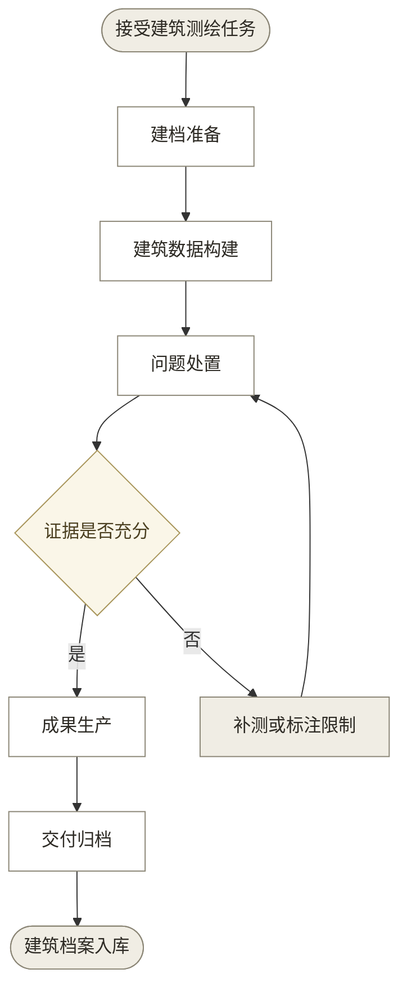
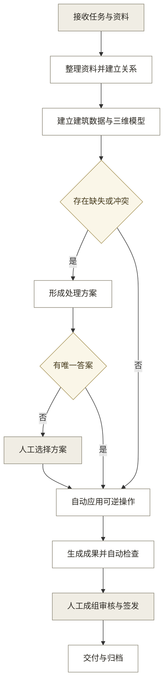
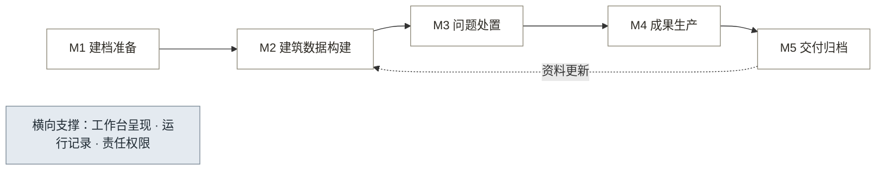

# 01 · 核心 PRD：古建保护成果工作台 v2.3

## 0. 项目任务摘要

当前任务是为测绘与文保勘察团队交付一套可公开展示的单栋古建成果生产链路。

| 项目 | 现行口径 |
|---|---|
| 第一用户 | 承担古建测绘、文保勘察与成果生产的团队 |
| 当前交付目标 | 从任务要求和原始资料生成可追溯的建筑数据、三维模型、专业图纸与成果包，完整链路可用于求职作品展示和商业演示；验收依据见 2.5 节与 `04_演示项目定义.md` |
| 核心规则 | 一栋建筑一份档案；实测事实、系统推测、人工确认分开记录；AI 负责资料理解和候选生成，确定性程序负责计算与文件生成，专业人员负责判断与责任签发；数据和成果均可追溯到来源、版本与责任人 |
| MVP 范围 | 本地单机、单栋建筑，覆盖 4.3 节 F01 至 F18，从资料入库到待签发成果生成、检查、导出与回导 |
| 排除项 | 法定签发与正式交付、多人实时协作、代替现场测量、通用建筑设计与工程计算、多期复查更新、档案管理方独立界面；完整清单见 4.4 节 |

## 1. 文档信息

**修订记录**

| 版本 | 日期 | 修订内容 |
|---|---|---|
| v2.0 | 2026-08-17 | 按四段骨架重构；14 项需求收敛为 M1 至 M5 五个模块，旧 R001 至 R014 编号停用 |
| v2.1 | 2026-08-17 | 补现状与残损记录、图纸样式设置、构件库条目复用三项功能；页面归属对齐界面文档十视图 |
| v2.2 | 2026-08-20 | 2.5 补验收目标分层，展示阶段先行、商业指标试点阶段验证；4.1 版本规划同步；新增 2.8 定位收敛说明与立项书假设处置 |
| v2.3 | 2026-08-24 | 明确成功展示项目可携带正式构建环境产生的复核签发记录；浏览器本机仍无签发权限；高都采用按测绘流程设定的演示实测记录并在界面持续说明数据边界 |

### 1.1 需求摘要

古建保护成果工作台面向承担测绘与保护成果生产的团队，把一栋建筑的照片、实测记录、历史图纸和任务要求，转成可追溯的三维模型、专业图纸和交付档案。AI 负责理解资料、分析问题和推进流程，确定性程序负责几何计算与格式生成，专业人员负责专业判断与责任签发。产品交付的是可复查、可更新、可长期使用的建筑档案。

### 1.2 流程概览

输入一栋建筑的任务要求与原始资料，依次完成建档准备、建筑数据构建、问题处置、成果生产，输出专业图纸、三维模型与交付档案。

（灰底为人工参与环节，白底为系统处理，菱形为证据条件判断）

**核心业务：**

1. **一栋建筑一份档案** — 从任务到交付形成单一建筑的完整档案，每个环节的输入与输出可回溯到原始资料。
2. **建筑数据可核对** — 实测事实、系统推测与人工确认三种状态分别记录，没有依据的尺寸不进入正式建筑数据。
3. **专业成果可交付** — 图纸与三维模型按测绘规范生成，可编辑、可打印、可归档，不是效果图。
4. **责任边界清晰** — 系统提出方案，程序执行计算，专业人员承担判断与签发，三者各自留痕。

## 2. 需求背景

### 2.1 愿景

为承担古建测绘与保护成果生产的团队，解决建筑档案建不完、建不规范、建完用不起来的问题。目标形态见 1.1 需求摘要末句。

### 2.2 目标用户

产品同时服务成果生产方与档案管理方，两类用户共享同一份建筑档案但责任不同。

**成果生产方**：测绘与文保勘察团队。

- **特征 A**：按项目交付，同一批资料需产出图纸、模型、报告等多种成果，重复整理与重复录入贯穿全程。
- **特征 B**：成果须通过甲方与主管部门的规范验收，责任落到具体签发人，无依据的内容不能出现在正式成果中。

**档案管理方**：区县文物与住建主管部门。

- **特征 A**：承担法定建档义务但不生产数据，收到什么就存什么。
- **特征 B**：需要跨项目、跨年度查询与比对，格式与口径不统一的档案无法复用。

### 2.3 现状与问题

**当前不足**（按维度分类，逐项独立可引用）：

- **资料维度**：一栋建筑的照片、实测记录、历史图纸、任务文件分散在不同载体，关系靠人记忆维持。
- **生产维度**：从资料到成果的整理、录入、绘图、核对环节以人工为主，同一事实在不同成果中重复录入。
- **标准维度**：数据采集精度、文件格式与元数据描述尚无统一标准，成果形态因人因项目而异。
- **复用维度**：已建档案多为一次性交付的静态数据，缺少来源关系与版本关系，后续查询、比对与更新困难。

**结果**：建档速度跟不上法定要求，已建档案难以支撑修缮设计、监管与研究等下游使用。第三次全国文物普查投入近 15 亿元形成的数据沉睡十余年，23 年间约 4.4 万处已登记文物消失（来源：三普全景报告与国家文物局公开答复，见调研底稿 E12）。

**根因**：缺少一个把资料、事实、成果和责任串在同一条链上的生产载体。现有系统集中在采集端与监管端两头，中间的成果生产环节仍靠人工与通用绘图软件拼接。省级一体化平台的功能定位是资源动态管理与保护全过程监管，用户为各级文物行政部门，属汇聚与监管层，档案数据的生产仍需另行采购（来源：陕西省文物局平台上线通知 2025-10，见调研底稿 E13）。

### 2.4 行业趋势

- **代际演进**：行业正从采集数字化走向成果数字化。第四次全国文物普查 2023 年 11 月启动、2026 年 6 月收尾，第三阶段任务为认定登记、建立国家不可移动文物资源总目录并逐级验收（来源：国务院关于开展第四次全国文物普查的通知，中国政府网）。截至 2025 年 9 月，三普登记的 76.7 万处文物全部完成复查，新发现文物超 13 万处（来源：中国政府网，见调研底稿 E2）。普查采集环节由国家统一软件覆盖，成果生产与持续归档处于窗口期。
- **价值验证**：需求已被真实采购验证。区县一级存在百万元级数字化采购（如北京顺义区不可移动文物数字化保护二期中标 375.4 万元，含 9 处古建三维采集重建，来源：中国政府采购网 2025-08，见调研底稿 E6）；2025 年中央下达国家文物保护资金 63.8 亿元且逐年延续（来源：财政部，见调研底稿 E5）；新修订《文物保护法》2025 年 3 月 1 日施行，压实各级政府责任并强化经费保障与考核（来源：国家文物局，见调研底稿 E3）。
- **能力边界**：构件自动识别尚不足以免除人工核对。点云构件语义分割的公开最好水平为 mIoU 43.7%（BIM-Net++ 在 HePIC 数据集，2025，来源：LTTM/Scan-to-BIM）。这决定产品必须让每个构件可人工确认，而非追求全自动。

### 2.5 目标与价值

**v1.0 定位**：在本地工作台上，把一栋建筑的原始资料转成有据可查的建筑数据与专业成果，解决成果生产环节重复劳动多、依据不可追溯的问题。

- **价值点 1**：同一份建筑数据驱动全部成果。三维模型、平面、立面、剖面、详图与报告引用同一版本，改一处数据，受影响成果同步失效并重新生成，不需要逐个成果手工同步。
- **价值点 2**：每个结论可回到依据。任一尺寸、构件与图面元素都能定位到原始资料、产生来源与确认人，成果被退回时只重做受影响部分。

**验收目标分层**：v1.0 分两个阶段验收，先展示后试点。

- **展示阶段（当前）**：验收对象是从任务书到成果归档的完整链路，每个环节有可操作页面和真实生成文件，可对外展示，服务求职与商业演示。展示项目中的数值、责任角色和签发记录用于呈现成功流程，不作为真实工程事实；验收标准见 `04_演示项目定义.md` 第 2 节与第 6 节。
- **试点阶段**：验收下方业务目标表中的三项指标。试点前用同一任务脚本、同一批资料与同一角色配置记录人工耗时与操作次数，作为对照基线；基线未取得前，周期类指标不可验收。

**业务目标**（三类企业价值中命中降低成本与提高效率两项，属试点阶段验证目标）：

| 目标 | 衡量指标 | 目标值 | 基线来源 |
|---|---|---|---|
| 减少重复劳动 | 非签发环节的重复录入与逐项确认次数 | 较人工基线减少 80% 以上 | 试点前用同一任务脚本实测，尚未取得 |
| 缩短单栋交付周期 | 从资料入库到代理成果输出的工作日 | 较人工基线缩短 50% 以上 | 同上 |
| 保证追溯完整 | 正式成果关键数据可定位到依据的比例 | 100% | 产品内可测，无需外部基线 |

两项周期类指标的人工基线尚未实测，标注为待验证目标。验证方式：试点前用同一任务脚本、同一批资料与同一角色配置记录人工耗时与操作次数，作为对照基线。

### 2.6 市场和竞品分析

同定位产品在公开范围内未见，空白位于成果生产层。

市场与竞品事实的原始出处为调研底稿 E1 至 E19，见 `../99_历史归档/01_文档历史版本/重分类归档_2026-08-16/00_目标用户调研与权重打分.md`；技术能力候选与开源平台对照见 `../06_研究底稿/01_AI与制图能力边界.md` 与 `../06_研究底稿/02_开源技术借鉴.md`。

| 类别 | 代表 | 形态 | 覆盖环节 | 关键限制 |
|---|---|---|---|---|
| 国内项目制服务商 | 帝测科技等测绘出身厂商 | 一次性交付数据与定制系统 | 采集、建模、展示、监测 | 自动整理与持续归档环节普遍缺失（调研底稿 E9） |
| 国际开源平台 | Arches（Getty 保护研究所） | 遗产资产管理平台 | 资产台账、词表管理 | 管资产不管成果生产，无中文生态与国内档案规范适配（E10） |
| 开源研究代码 | scan-to-BIM 研究集群 | 点云到模型的算法实现 | 单点技术环节 | 研究性质，无业务流程、证据溯源与责任机制 |
| 省级一体化平台 | 陕西、福建等省平台 | 政府汇聚与监管系统 | 资源管理、监管 | 定位为监管层，档案生产仍需另行采购（E13） |

**结论**：行业已验证采集端工具与监管端平台的价值，竞品集中在这两头；从资料到合规成果的生产环节没有产品化方案，仍靠人工与通用绘图软件拼接。本产品的差异化锚点是把证据约束、成果生成与责任留痕做进同一条生产链。

### 2.7 旧版本

v1.3 及更早版本的需求背景与需求编号体系（R001 至 R014）归档于 `../99_历史归档/`，不在本文档维护。

### 2.8 定位收敛说明

产品定位从"面向区县文物部门及乙方生态的 AI 古建档案引擎"收敛为"面向测绘与文保勘察团队的成果生产工作台"：第一用户由区县文物部门（toG）改为成果生产方，产品形态由平台改为本地单机工作台。旧定位的 MRD 与立项书于 2026-08-16 归档至 `../99_历史归档/01_文档历史版本/重分类归档_2026-08-16/`，本节为回溯性记录。

**收敛内容**（前后对照）：

| 维度 | 旧定位（MRD 与立项书） | 现定位（本文档） |
|---|---|---|
| 第一用户 | 区县文物部门 | 测绘与文保勘察团队（成果生产方） |
| 第二用户 | 测绘/文保乙方、下游使用方 | 区县文物与住建主管部门（档案管理方，v1.0 通过交付包与退回机制服务，不做独立界面） |
| 产品形态 | 档案引擎、平台 | 本地单机工作台 |
| 覆盖环节 | AI 整理、标准归档、关联、侦测 | 单栋建筑从建档准备到交付归档的五个模块 |
| 首个验收对象 | 未定义 | 可展示的完整链路（2.5 节验收目标分层） |

**收敛原因**：MVP 落在单一可验证的链路上。归档与侦测需要至少一期档案基线，平台形态需要多用户与真实身份，均超出单机 v1.0 范围，对应 4.4 节本期不做清单。原决策过程没有单独记录，原因表述为回溯性判断，与可核验的收敛内容分开陈述。

**立项书核心假设的处置**（假设原文与验证方式见立项书第 3 节核心假设清单）：

| 假设 | 内容 | 处置 | 跟踪落点 |
|---|---|---|---|
| H1 | 大模型能从古建照片识别部件并输出制图可用的结构化数据 | 部分验证后继续跟踪 | PoC 路线 1 已跑通、识别率量化待盲测（`../05_验证证据/02_PoC工作流验证/05_PoC路线1验证报告.md`）；识别能力与上限见 `../06_研究底稿/01_AI与制图能力边界.md` |
| H2 | 乙方愿为图纸闭环工具付费 | 未验证，留待试点阶段 | 验证方式为一家乙方真实项目对照与付费意愿摸底；不阻塞展示阶段 |
| H3 | 省平台建成后区县仍有独立采购空间 | 随 toG 主线暂停 | 恢复条件：重新评估 toG 主线时 |
| H4 | 区县存在四普后建档考核与预算 | 随 toG 主线暂停 | 恢复条件：同 H3 |

## 3. 业务流程

### 3.1 业务流程

主流程由系统推进，只在三类节点等待人工：补充系统无法获得的现场事实、选择没有唯一答案的专业方案、审核成组成果并承担签发责任。

缺少现场尺寸、测量方法或原始记录时，系统生成补测清单并保留未知状态，不用默认值补齐。存在多个有证据支持的方案时，系统合并同类问题一次交人工选择。

证据不足且用户选择继续时，成果按草图降级输出：全程标注估算来源与限制条件，不能进入正式交付，降级决定记录决定人、时间与理由。

### 3.2 用户故事

- **P0** 作为成果生产方，我把一栋建筑的资料整批交给系统，以便于不再逐份登记和分类。
- **P0** 作为成果生产方，我在照片上圈出位置并说明问题，以便于直接修正记录而不必回到表格逐项填写。
- **P0** 作为成果生产方，我一次审核一组相关修改，以便于把时间用在专业判断而非逐条点击。
- **P0** 作为成果生产方，我从任一尺寸查看它的来源，以便于确认成果可以对外承担责任。
- **P0** 作为专业审核人，我查看成组成果预览并一次接受，以便于完成审核与签发而不重复操作。
- **P0** 作为档案管理方，我核验交付内容的完整性与限制条件，以便于判断能否入库。由 F16 交付包生成承接。
- **P1** 作为成果生产方，我在资料不足时得到明确的补测清单，以便于安排下次现场工作。
- **P1** 作为成果生产方，我修改一处数据后只重做受影响的成果，以便于避免整批返工。
- **P1** 作为档案管理方，我退回其中一张图纸，以便于让对方只修正该部分。由 F17 退回与局部重做承接。
- **P1** 作为成果生产方，我导出并在另一台设备继续工作，以便于在不同环境间迁移项目。

## 4. 功能规划

### 4.1 版本规划

| 版本 | 目标 | 范围 | 不做 |
|---|---|---|---|
| v1.0 | 从资料到待签发成果的生产闭环，验收目标见 2.5 节 | 单机工作台，本地数据，成果归档 | 本机法定签发、多人在线协作 |
| v2.0 | 从待签发成果到正式交付 | 接入真实身份、权限与签名，支持私有部署 | 跨机构数据交换平台 |

### 4.2 功能架构

五个模块沿建筑档案的生命周期排列，工作台呈现、运行记录与责任权限为横向支撑，不单独成模块。

### 4.3 功能清单

| 编号 | 功能名称 | 模块 | 页面 | 优先级 | 验收标准 |
|---|---|---|---|---|---|
| F01 | 任务要求确认 | M1 | 任务卡 | P0 | 有唯一依据的内容不要求人工确认；任务要求变更时给出受影响成果清单。2026-08-22 注：后半条当前达不到，任务书与出图要求之间没有记录互相引用，程序算不出受影响的图纸，只能如实说算不出来。缺口与补法见路线图技术债表 |
| F02 | 资料批量入库 | M1 | 资料清单 | P0 | 原文件、来源与权属完整保留，解析失败不丢原件 |
| F03 | 项目数据导入导出 | M1 | 项目列表 | P0 | 导出后在空库回导，资料、来源、决定与成果关系完整 |
| F04 | 建筑对象与关系建立 | M2 | 构件清单 | P0 | 对象类型引用受控词表，未知部位保持未知不填默认值 |
| F05 | 尺寸规则核对与推算 | M2 | 实测基准 | P0 | 每条规则标注规范出处，推算值标记来源且可人工确认 |
| F06 | 现状与残损记录 | M2 | 现状记录 | P0 | 可见残损与构造关系记录到具体构件，不可见部位保持待复查不作推断 |
| F07 | 三维模型生成 | M2 | 三维模型 | P0 | 同一批成果引用同一模型版本，未知几何在模型中可见 |
| F08 | 构件库条目复用 | M2 | 构件清单 | P1 | 经责任人确认的形制判断存为词表条目，后续建筑引用同一条目并保留确认记录 |
| F09 | 问题分析与方案生成 | M3 | 问题队列 | P0 | 同一原因的问题合并为一组，每个方案给出证据与影响范围 |
| F10 | 成组审核与逐条确认 | M3 | 问题队列 | P0 | 满足自动条件的修改不弹确认框且可撤销 |
| F11 | 照片框选修正 | M3 | 构件清单 | P0 | 框选加一句话即可完成修正，修正进入修改历史 |
| F12 | 图纸样式设置 | M4 | 图纸样式 | P0 | 画法、标注规则与图签取自受控样式集合，样式变更使受影响图纸失效 |
| F13 | 图纸生成 | M4 | 图纸与检查 | P0 | 平立剖详图由同一模型版本投影生成，比例与图幅来自任务要求 |
| F14 | 成果自动检查 | M4 | 图纸与检查 | P0 | 数据、几何、图面与文件结构检查不需要人工逐项点击 |
| F15 | 专业审核与签发 | M4 | 图纸与检查 | P0 | 同一责任人一次接受完成审核与签发，职责分离时才二次操作 |
| F16 | 交付包生成 | M5 | 交付包 | P0 | 交付包含成果、检查记录、来源说明与限制条件，各文件标注对应的档案卷类别 |
| F17 | 退回与局部重做 | M5 | 交付包 | P1 | 退回一项只使受影响内容失效，无关成果保持有效 |
| F18 | 助手动作执行 | 横向 | 全部页面 | P0 | 受控动作的实现状态以代码登记表为准（`packages/domain/src/assistant-action-delivery.ts`），只有端到端可用的动作进入模型可见目录，确认级别与留痕见界面文档第八节 |

页面定义见 `03_界面与交互形态.md` 表 2。

### 4.4 需求范围

**本期做**：单栋建筑从资料到待签发成果的完整生产链路，含上表 18 项功能。公开展示项目可随项目包载入正式构建环境生成的只读签发记录，用于呈现归档完成状态。

**本期不做**：

- 在浏览器本机完成法定签发与正式交付。本地环境无可验证身份，只能核对随项目包导入的正式环境签发记录。
- 多人实时协作。当前为单机工作台，协作通过项目包交换实现。
- 代替现场测量。照片与模型不能补出不存在的实测事实。
- 通用建筑设计与工程计算。产品服务既有建筑的记录与保护成果。
- 复查更新。多期资料比对与变化判定需要至少两期档案，v1.0 尚未建立第一期基线。
- 档案管理方的独立界面与入库操作。v1.0 是单机工作台，档案管理方通过交付包核验与退回机制参与，不设独立角色界面。
- 法定记录档案的主卷、副卷、备考卷结构对应。代理成果不具备进入法定档案的资格，交付包本期只标注各文件对应的卷类别。

**依赖**：

- 上游：任务要求与原始资料由用户提供，资料质量决定成果范围。
- 横向：工作台呈现随各功能的页面归属交付；模型运行记录与责任权限作为支撑能力随功能实现，不单列需求。
- 演示：产品对外展示使用的项目、选择依据与演示路径见 `04_演示项目定义.md`。高都的实测记录为按测绘方法设置的演示值，清式样板为参数化定义；两者均持续显示适用边界。
- 判定依据：人工节点的完整矩阵见本文附录 A，助手动作清单与确认机制见 `03_界面与交互形态.md` 第七节，专业成果质量底线见 `../02_技术/03_专业制图与建模质量基准.md`。

## 附录 A · AI 与人工节点审查

本附录展开第 3.1 节三类人工节点的完整矩阵。人机分工的口径以 A.4 节为准，其他文档引用不另设定义。

### A.1 结论

人工审核只保留三类责任：

1. 补充系统无法取得的现场事实；
2. 选择没有唯一答案的规范、构造或专业方案；
3. 审核成组成果并完成责任签发。

项目创建、资料上传、项目选择和导出是用户发起工作的操作，不是专业审核节点。技术检查、资料分类、对象关联、唯一规则结果、成果失效和流程状态由系统处理。

### A.2 节点审查

| 现有操作 | 是否保留人工 | AI 或程序先做什么 | 批量或自动方式 | 删除风险与处理 |
|---|---|---|---|---|
| 创建或导入项目 | 保留用户操作 | 预填项目元数据，校验项目包 | 支持批量导入 | 用户必须明确启动项目；不作为审核门槛。 |
| 上传任务书或描述目标 | 保留用户操作 | 提取成果、规范、期限和责任要求 | 从已有项目包继承 | 系统不能擅自取得本地委托资料。 |
| 确认范围、规范、成果和角色 | 条件式保留 | 提取原文，引用组织设置，列出缺失和冲突 | 有唯一依据时自动记录；其余合并处理 | 删除固定“一次确认”；只处理缺失、非唯一选择和责任分配。 |
| 导入照片、测量和图纸 | 保留用户操作 | 自动分类、转写、关联和查缺 | 拖放、目录和项目包批量导入 | 不要求用户先选文件类型或逐份确认。 |
| 补充缺失现场事实 | 保留 | 生成对象化补测清单和位置提示 | 测量表批量录入 | 删除会造成伪造或永久未知。 |
| 资料分类、对象关联和测量转写核对 | 删除固定确认 | 给出来源、置信和冲突 | 唯一且低风险时自动写入；异常成组处理 | 只把证据不足或冲突送入人工队列。 |
| 审核关键模型预览 | 改为条件式 | 检查几何、证据和影响 | 按构件组、视图组审核 | “关键”范围过宽。风险只能决定成组审核的优先级；人工仍只补充事实、选择非唯一方案或审核成组成果。 |
| 选择规范、构造或专业方案 | 保留 | 提供候选、依据、差异和成果影响 | 同原因问题合并决定 | 没有唯一答案时必须保留责任判断。 |
| 接受、调整或驳回处理方案 | 条件式保留 | AI 形成完整方案和预览 | 非唯一专业决定可以成组处理 | 满足自动条件时直接执行；只有非唯一专业决定需要接受、调整或驳回。调整、驳回或制度要求时记录理由。 |
| 选择成果集、比例、图幅和目录 | 删除重复选择 | 从当前任务要求版本读取 | 有唯一结果时自动生成 | 只有要求缺失或变更时重新进入任务节点。 |
| 手动切换成果状态 | 删除 | 数据变化自动计算失效、检查和待生成状态 | 自动推进 | 保留“重试生成”作为故障恢复，不让用户维护业务状态。 |
| 技术检查逐项确认 | 删除 | 程序运行数据、几何和 CAD 检查 | 自动执行并汇总 | 人工只看失败项和影响范围。 |
| 成组专业成果审核 | 保留 | 自动检查，生成差异摘要和成组预览 | 可局部退回 | 专业质量和责任不能由程序替代。 |
| 接受成果后再次签发 | 合并或职责分离 | 核对身份、权限和阻断项 | 同一责任人可一次完成审核和签发 | 只有组织制度要求两人分工时拆成两个节点。 |
| 选择代理或正式交付类型 | 删除 | 系统按证据、检查、身份和权限计算 | 自动限制可执行操作 | 人工不能提升正式资格。 |
| 发起导出或交付 | 保留用户操作 | 生成清单、版本和资格摘要 | 一次生成成果包 | 对外文件和责任动作需要明确意图。 |
| 接收人接受或退回 | 保留 | 核验清单并定位差异 | 成组接受或局部退回 | 接收责任不能由系统代替。 |
| 正常项目包导入确认 | 删除 | 自动校验、迁移和原子导入 | 无风险项目直接导入 | 只有迁移冲突、安全异常或覆盖风险才询问。 |
| 模型任务自动权限 | 只在设置或变更时保留 | 提供质量、费用和风险记录 | 沿用项目策略 | 不逐次询问。 |
| 建立身份、角色和权限 | 缺失或变更时保留 | 推荐最小权限，检查冲突 | 从组织目录和项目模板取得 | 不在每次确认弹窗重复填写身份。 |
| 模型资料传输范围 | 只在策略外资料出现时保留 | 分类文件和用途，提示敏感范围 | 按项目策略自动执行 | 未覆盖的敏感资料必须等待决定。 |
| 重大更新审核 | 删除笼统节点 | 计算变化、影响和版本差异 | 唯一、可逆更新自动处理 | 只有新增现场事实、非唯一方案或已签发成果变更进入人工节点。 |

### A.3 自动执行条件

同时满足以下条件时，系统可以自动执行：

- 证据直接支持结论，或已确认规则只能得到一个结果；
- 操作在当前权限和资料传输策略内；
- 操作可撤销，并有完整审计记录；
- 不改变现场事实、专业方案、正式资格或已签发成果；
- 输入版本仍是当前版本。

任一条件不满足时，系统生成问题、依据、影响范围和建议。缺少现场事实时进入补测队列；有多个有效方案时进入专业选择；涉及签发时进入成组审核。

### A.4 AI 与程序边界

AI 负责：

- 任务和资料理解；
- 资料分类、转写和对象候选关联；
- 专业存疑、规则冲突和风险分析；
- 处理建议、影响说明和审核摘要；
- 调用授权工具并解释结果。

确定性程序负责：

- schema、单位、哈希、权限和版本校验；
- 尺寸、几何、规则和依赖计算；
- 成果失效、正式资格和交付门槛；
- 原子写入、审计和文件生成。

AI 不能编造实测、改变规则结果、授予正式资格或冒充签发人。程序也不能把技术检查通过解释为专业审核通过。

**问题只能由人工决定关闭。** 规则重跑不构成关闭理由：这一轮没有重新提出某个问题，只说明这一轮没查它，不等于问题不存在。程序可以把同一个问题的旧版本标为已被替代，前提是本轮提出了接替它的新版本；没有接替就保持未解决。2026-08-22 之前的实现每跑一次规则核对就把全部未解决问题标成已被替代并盖上解决时间，三个演示项目共 13 条没人处理过的问题因此在问题队列与交付阻断里同时消失，是本条要挡住的情形。

**界面上的状态词一律取代码的标签表取值，不另造词。** 来源、审核状态、数据状态、解析状态、问题类型五张表是界面用词的唯一出处，见 `../02_技术/01_技术架构.md` 与 `apps/workbench/src/App.tsx`。原型上出现表外的词（例如把缺资料写成缺证据）按不符合处理，不是措辞偏好问题：表外的词在代码里没有对应枚举，实现时只能靠猜。

**费用按公开单价与真实用量算得，单价要记出处与取值日期。** 单价表里没有的模型如实写明算不出，不拿别的模型的单价顶替，也不显示为零。缓存命中的输入按命中价单独计价。界面上标明以服务商账单为准。

### A.5 节点验收指标

本节只列人工节点设计自身的指标。产品级业务目标由第 2.5 节定义，本附录不另设口径。

| 指标 | 计算方式 | 目标 |
|---|---|---|
| 问题分组处理率 | 已进入自动处理、成组审核或签发阻断的问题数 ÷ 问题总数 | 100% |
| 无依据人工节点 | 无法说明责任、风险或必要性的人工节点数 | 0 |
| 自动处理撤销能力 | 自动操作中可从审计记录撤销的操作数 ÷ 自动操作总数 | 100% |
| 重复身份录入 | 同一任务中重复填写已有责任身份的次数 | 0 |
| 人工提升资格 | 人工绕过资格规则将代理成果改成正式成果的次数 | 0 |
