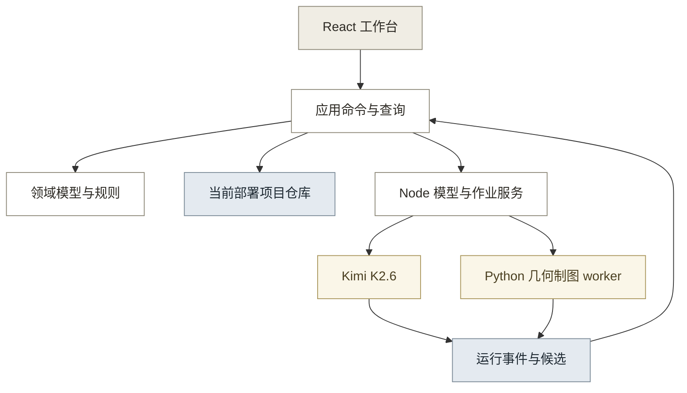
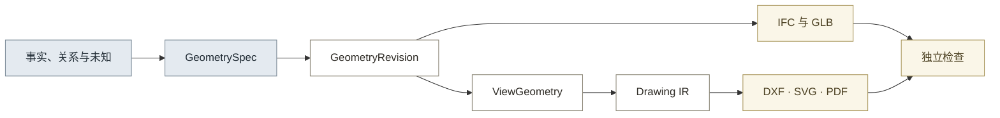

# 01 · 技术架构 v1.9

## 0. 工程约束摘要

当前工程采用单机优先的模块化结构，项目数据只经当前部署的命令服务写入。

| 类别 | 工程约束 |
|---|---|
| 技术栈 | Node 20.19 以上、pnpm 11.16、React、TypeScript、Vite、独立 Node 服务、Python 3.12 与 CadQuery 2.8；依赖版本以锁文件为准 |
| 数据权威 | 本地模式以浏览器 `ProjectCommandService` 和 IndexedDB v3 库为真源，私有部署以服务端命令服务、PostgreSQL 与对象存储为真源；同一部署只启用一个命令权威 |
| 目录边界 | 工作台与服务端位于 `apps/`，领域、应用和基础设施位于 `packages/`，CAD worker 位于 `workers/cad/`；测试就近放置；旧原型只保留回归读取，详见 4.3 节 |
| 测试 | TypeScript 类型与单元、集成测试，Python pytest，CAD、浏览器和专业人工检查分层执行；单元收口运行 `node .claude/skills/quality-check/scripts/run-all.mjs --full` |
| 安全 | 项目文件按不可信输入处理，SVG 预览净化，模型服务只访问固定官方地址，worker 使用受限临时目录且无网络；公开仓库排除密钥、私有资料、外部 DWG 和绝对路径 |
| 禁止方案 | 界面、AI、规则或 worker 直接写项目；默认值补造缺失实测；新功能写入旧原型；DWG 进入生成输入；本地模式开放法定签发；同一部署保留两个项目真源 |

## 1. 架构结论

目标系统采用“React 工作台 + TypeScript 领域内核 + 独立 Node 服务 + Python 制图 worker”。项目数据只有一个写入入口。AI、规则和制图程序都只能返回候选或成果，不能直接改写项目。

本地模式以浏览器本地 v3 库（数据库版本 7，见 6.2）为项目真源。私有部署以服务器数据库和对象存储为项目真源。两种模式共用领域契约，但同一部署只能启用一个命令权威。

三维、平面、立面、剖面、详图、DXF、SVG 和 PDF 必须引用同一 `GeometryRevision`。几何冻结只表示生成输入固定，不代表通过专业审核。新成果统一标记为 `generated-not-qualified`，并保持 `L1=false`。

本文件定义目标状态和迁移方案，实施进度以 [路线图](../04_实施单元/00_路线图.md) 为准。

### 1.1 架构目标

- PRD 的五个模块 M1 至 M5 与横向支撑都能映射到数据、模块、接口和测试。
- 项目事实、模型候选、规则结果、人工决定和演示数据可以区分并追溯。
- 样例数据只通过项目包进入系统，不进入页面、命令或生成器代码。
- 数据变化只使真正依赖它的几何、成果、检查和交付准备失效。
- Kimi K2.6 负责资料理解、问题分析和工具调用。程序负责规则、几何、制图、资格和交付门槛。
- 中断、刷新、模型失败和 worker 失败后，可以从最近有效项目版本继续。

### 1.2 当前实施边界

- 当前阶段先完成本地代理生产流程，不实现法定签发。
- 私有部署保留真实身份、权限、服务器项目库和签名接口；这些适配器在后续任务实现。
- 首期交换格式为 JSON、项目 ZIP、IFC、GLB、DXF、SVG 和 PDF。
- DWG 不在当前实施范围。外部 DWG 只能作为人工质量参照，不能进入生成输入或项目事实。
- 规范 CAD 的当前资格工具为 AutoCAD 2024。QCAD 3.32.9 只承担打开、查看和打印兼容检查。
- 兼容工具保存的副本不得覆盖规范 DXF，也不得作为资格证据。

### 1.3 依据与约束

- 产品范围以 [核心 PRD](../01_产品/01_核心PRD.md) v2.2 为准。
- 专业制图和三维模型以 [质量基准](03_专业制图与建模质量基准.md) v0.7 为最低标准。
- Kimi、开放制图技术和样本事实以 [AI 与制图能力边界](../06_研究底稿/01_AI与制图能力边界.md) 研究结论及其官方来源为准。
- 人工节点以 [核心 PRD](../01_产品/01_核心PRD.md) 附录 A 的完整矩阵为准，不得重新加入已删除的确认弹窗。
- 助手动作清单与确认机制以 [界面与交互形态](../01_产品/03_界面与交互形态.md) 第八节为准。
- 当前实现状态以 [路线图](../04_实施单元/00_路线图.md) 与验证证据目录为准。
- CAD 验收按 PRD 区分规范资格工具和第二兼容工具。该规则取代 [质量基准](03_专业制图与建模质量基准.md) 中第二工具也需编辑、保存和无损往返的旧表述；T0a 同步修订质量基准。

## 2. 实施状态入口

实现进度、已完成阶段与下一步以 [路线图](../04_实施单元/00_路线图.md) 为准，本文不复制。

## 3. 方案选择

目标架构使用新的应用入口和数据真源，不在旧入口上继续增加条件分支。三种方案的比较见表 2。

**表 2：架构方案比较**

| 方案 | 做法 | 收益 | 主要风险 | 结论 |
|------|------|------|----------|------|
| 保守扩展 | 继续修改旧页面、v2 数据库和浏览器生成器 | 改动较少 | 固定样例、版本混用和图纸不同源继续存在 | 不采用 |
| 模块化单体 | 新建工作台、领域内核、v3 仓库和受控 worker | 数据责任明确，适合任务级迁移 | 需要同时维护 Node 与 Python 环境 | 采用 |
| 多服务平台 | 将项目、模型、几何和交付拆成独立服务 | 适合大规模组织 | 当前并发和运维需求不足 | 暂不采用 |

几何内核采用 CadQuery/OCP。它负责受控实体、布尔、真实剖切和投影。IfcOpenShell 负责 IFC 交换和语义映射，不作为唯一几何生成入口。ezdxf 负责原生 DXF。Three.js 只负责 GLB 预览和对象选择。

## 4. 总体架构与部署权威

目标架构分为界面、应用、领域、适配和数据五层。如图 1 所示，外部结果必须回到当前部署的命令权威后才能成为项目记录。

**图 1：目标系统分层与数据流**



### 4.1 模块职责

各模块的写入责任和禁止范围见表 3。

**表 3：模块职责**

| 模块 | 负责 | 不负责 |
|------|------|--------|
| 工作台 | 项目、证据、模型、图纸、问题、审核和交付操作 | 直接写项目仓库 |
| 应用层 | 用例、权限、事务、幂等和外部结果提交 | 解释古建专业事实 |
| 领域层 | 不变量、来源、自动策略、依赖、资格和失效 | 网络、文件和页面状态 |
| 项目仓库 | 版本、记录、资源、审计和索引 | 调用模型或生成文件 |
| 模型任务服务 | Kimi 运行、流式事件、取消、重试、用量和费用 | 写业务事实或授予资格 |
| 规则引擎 | 固定输入和规则版本的可重复结果 | 作非唯一专业判断 |
| 几何服务 | 对象几何、连接、未知项、真实剖切和投影 | 补造缺失尺寸 |
| 制图服务 | Drawing IR、标注、版面和文件生成 | 改写项目事实 |
| 检查服务 | 数据、几何、视图、CAD 和项目包检查 | 替代专业审核 |
| 身份与签名 | 身份、权限、资格和签名验证 | 自动认可专业结论 |

### 4.2 两种部署模式

两种部署只能选择一个命令权威，具体差异见表 4。

**表 4：部署权威**

| 模式 | 命令权威 | 项目真源 | 资源存储 | 正式签发 |
|------|----------|----------|----------|----------|
| 本地验证 | 浏览器内 `ProjectCommandService` | 本地 v3 库（版本 7） | IndexedDB Blob | 锁定，只允许代理交付 |
| 私有部署 | Node 内 `ProjectCommandService` | PostgreSQL | S3 兼容对象存储 | 接入身份、权限和签名后开放 |

本地模式的 Node 服务只运行模型任务和制图作业，不保存项目真源。worker 结果通过浏览器命令提交。

私有部署的浏览器只能发命令和查询。Node 从服务端会话取得 `actorId`，忽略浏览器负载中的身份声明。浏览器缓存和离线草稿不是已提交业务数据。

### 4.3 目录边界

```text
apps/
├─ workbench/          React、TypeScript、Vite 工作台
└─ server/             Node API、Kimi 和作业控制
packages/
├─ domain/             数据契约、不变量、依赖和资格
├─ application/        命令、查询和用例
└─ infrastructure/     IndexedDB、项目包、证据摄取与工作流
workers/
├─ cad/                Python 几何、视图、Drawing IR 和文件检查
└─ samples/            公开样本的获取与校验脚本
tools/                 端口释放、示例转换等运维脚本
```

测试就近放在被测代码所在的包内：TypeScript 测试为各包 `src/**/*.test.ts`，Python 测试为 `workers/` 各子目录的 `test_*.py`。每个包配置独立的 `vitest.config.ts`，可单独执行；根 `vitest.config.ts` 汇总 `packages/*`，根 `test` 脚本再串联两个 `apps`。不设集中的 `tests/` 目录，理由是包必须能独立验证（见 §4.1 模块职责），且 pytest 按目录发现测试。

新代码不写入 `交互原型/02_AI工作台`。旧目录只供迁移测试和行为回归读取。样本保存在 `文档/05_验证证据` 或测试资源目录，通过项目包加载。

## 5. 最小项目模型

项目模型使用稳定英文键、UUID 和带时区的 ISO 8601 时间。界面和数据字典显示中文名称。二进制文件只通过 `assetId` 关联。最小持久化对象见表 5。

**表 5：最小持久化对象**

| 对象组 | 核心对象 | 来源与状态 | 更新入口 | 主要影响 |
|--------|----------|------------|----------|----------|
| 项目与任务 | `Project`、`Building`、`TaskDefinition`、`ProjectRevision` | 建项、任务书、组织设置和决定 | 项目与任务命令 | 全部下游范围 |
| 资料与证据 | `Asset`、`Evidence`、`EvidenceRelation` | 原文件、导入声明和解析记录 | 资料导入与关联命令 | 事实、对象、几何和成果 |
| 构件与事实 | `HeritageEntity`、`Relation`、`Observation`、`MeasurementRecord` | 证据、模型、规则或人工 | 事实提交或候选应用命令 | 几何、说明和检查 |
| 运行与候选 | `ModelTaskInputSnapshot`、`ModelRun`、`ModelAttempt`、运行事件、`ModelProposal`、`RuleRun` | 固定输入、真实运行和确定性规则 | 模型与规则命令 | 问题和候选应用 |
| 问题与决定 | `Issue`、`Option`、`Decision`、`PolicyEvaluation` | AI 分析、规则冲突和人工责任 | 问题与决定命令 | 事实、成果和资格 |
| 几何与成果 | `CadJobInputSnapshot`、`CadJob`、`CadJobEvent`、`GeometryRevision`、`ViewGeometry`、`DrawingIR`、`Artifact`、`CheckRun` | 固定输入、作业和生成程序 | 几何与成果命令 | 交付与后续失效 |
| 资格与审核 | `FactEligibilityEvaluation`、`ProfessionalReview`、`ArtifactApprovalSignature`、`ArchiveSigningAuthorization`、`ArtifactQualificationEvaluation` | 程序评估、专业审核和签发 | 评估与审核命令 | 成果资格与责任 |
| 交付 | `DeliveryDraft`、`DeliveryManifestSignature`、`FormalDeliveryRelease` | 资格评估、签名和发布 | 交付命令 | 允许的交付类型 |
| 审计 | `AuditEvent`、`CommandReceipt` | 每次命令和外部运行 | 仓库随命令自动追加 | 查询、恢复和责任还原 |

`TaskDefinition` 是成果目录、比例、图幅、图纸要求、CAD 资格工具、项目制图标准和交付范围的唯一业务来源。成果模块不能另存一套可编辑要求。

### 5.1 来源判别

业务事实只允许模型、规则、人工和演示四类产生来源。系统行为只进入审计。

```ts
type ProducerRef =
  | { producerType: 'model'; runId: string }
  | { producerType: 'rule'; ruleRunId: string }
  | { producerType: 'human'; actorId: string; commandId: string; decisionId?: string }
  | { producerType: 'demo'; fixtureId: string }

interface FactEnvelope<T> {
  id: string
  subjectRef: string
  field: string
  value: T
  producer: ProducerRef
  evidenceRefs: string[]
  reviewStatus: 'unreviewed' | 'confirmed' | 'rejected' | 'superseded'
  dataStatus: 'available' | 'uncertain' | 'missing' | 'stale'
}
```

人工接受模型转写后，事实仍保留 `model` 来源；人工改写数值时才建立新的 `human` 事实。规则结果始终保留 `rule` 来源。演示数据始终关联 `fixtureId`，不得显示成真实模型结果。

### 5.2 单位与未知项

数值类型按物理含义区分。离散数量不得记录成毫米。

```ts
type TypedValue =
  | { kind: 'length'; value: string; unit: 'mm' | 'cm' | 'm' | 'in' | 'ft' }
  | { kind: 'angle'; value: string; unit: 'deg' | 'rad' }
  | { kind: 'count'; value: number; unit: 'each' }
  | { kind: 'ratio'; value: string; unit: 'ratio' | 'percent' }

interface UnknownValue {
  unknownType: 'missingEvidence' | 'notObserved' | 'unresolvedConflict' | 'notApplicable'
  subjectRef: string
  requiredFor: string[]
  evidenceRefs: string[]
  resolutionAction?: 'remeasure' | 'professionalDecision' | 'limitOutput'
}
```

长度保留原值、原单位、规范化值、精度和换算版本；`rows`、`columns`、`countPerLeaf` 和 `longitudinalSegments` 使用 `count`。没有依据的值保存为 `UnknownValue`，不得写 `0` 或样例默认值。

`MeasurementRecord` 至少保存测量对象、原值、单位、测量人、时间、方法和原始证据。AI 转写只能先建立候选，人工核对不能补成不存在的实测元数据。

### 5.3 几何、构造与资格分离

几何是否有效、构造是否有证据和成果是否具备专业资格是三项独立判断。

- `GeometryRevision` 保存几何输入、输出、单位、引擎版本、对象映射和未知项。
- 构件保存 `geometryStatus`：`resolved | simplified | placeholder | unknown`。
- 构造关系保存 `constructionStatus`：`evidenceResolved | demoDefined | unknown | notApplicable`。
- `ProfessionalReview` 保存审查人、版本、问题和结论。
- `FactEligibilityEvaluation` 是独立不可变记录。它固定事实、项目版本、证据、测量元数据、适用规则、评估策略、结果和阻断原因。
- `ArtifactQualificationEvaluation` 只能引用事实资格评估、成果有效性评估、检查、专业审核和成果批准签名的验签结果，不能直接把原事实或人工确认解释为合格。代理审核缺少真实签名时只能得到代理资格。

生成器不能写入 L1 通过结论；没有独立专业审核时，成果保持 `generated-not-qualified` 和 `L1=false`（见 §5.1）。

模型转写的尺寸继续保留 `model` 来源。缺少测量人、时间、方法、单位或原始记录时，对应 `FactEligibilityEvaluation` 必须返回阻断码，该尺寸不得用于正式成果、正式标注或 L1 资格；人工确认转写准确不能解除这些阻断。

### 5.4 版本、依赖与审计

`ProjectRevision` 是不可变快照。事实、运行、规则、决定、几何、成果、检查、资格和交付都只追加。`ProjectHead` 只是可重建索引。

依赖边使用稳定引用，基本路径如下：

```text
证据 → 事实或决定 → 几何约束 → GeometryRevision → ViewGeometry → DrawingIR → Artifact → CheckRun → Delivery
```

数据变化后，`ImpactService` 只遍历对应下游边。旧成果不改写；系统追加新的有效性评估。已交付或已签发版本始终保留。

依赖边按记录已有的引用字段推导，不另存一张边表（2026-08-22 单元 07 起）。`ArtifactRecord.geometryRevisionId`、`CheckRun.artifactRefs`、`DeliveryDraft.evaluationId` 这类字段本身就是权威的，另存一份边只是它们的副本，两者一旦不同步，算出来的影响范围就是错的且不会报错。`ProjectSnapshot.dependencyEdges` 字段保留但恒为空，由测试锁住数据与源码两侧。推导实现见 `packages/application/src/impact-service.ts`。

推导覆盖不到两处，算出来的结果会显式说明算不全，不给一个偏小的数字：一是几何对象引用形制参数时写的是 `archetype:<ruleSetId>:<key>` 合成字符串而非 `ArchetypeSpec` 的记录 id，且 `ArchetypeSpec` 不在快照里，因此事实到形制参数到几何这条链断了一节；二是 `ArtifactRequirementMatrix` 只指回几何版本，不指回产生它的任务书，任务书一侧也不存它的 id，因此改任务要求算不出受影响的图纸，而这正是 F01 要的。两处都属数据模型缺口，补法是让记录之间互相引用，另排单元。

每条资源保存 SHA-256。项目版本保存内容哈希和审计链头。导出时重新计算所选版本可达的记录、资源和审计事件，不能按项目 ID 混入未来记录。

项目包根由 `(projectRevisionId, auditHeadHash)` 组成。业务记录闭包和截至审计头的完整事件前缀分别校验。失败、取消和迟到的模型与 CAD 作业事件即使没有产生项目版本，也必须进入对应审计前缀。

本地 Node 账本不是第二业务真源。IndexedDB 保存通过同步命令接收的运行和作业事件，并为每个外部流记录 `lastSyncedSequence`、`lastSyncedEventHash`、`externalHeadHash` 和 `syncStatus`。`syncStatus` 只允许 `pending | complete | failed`。

浏览器按事件序号和前一事件哈希幂等调用 `SyncModelRunEvents`、`SyncCadJobEvents`。重复事件返回原回执；跳号、哈希断裂、run/job 绑定不符或终态后伪造正常事件均拒绝。同步失败不改写既有事件。

项目包导出前必须同步所有属于审计截止点的外部事件，并证明 IndexedDB 事件头等于 Node 账本头。存在 `pending`、断点、无法取得账本头或未同步终态时，只允许导出带 `EXTERNAL_EVENT_SYNC_INCOMPLETE` 阻断的恢复包，不能生成代理或正式交付。回导后保存原事件序号与哈希，并从新的本地账本会话继续追加，不重写原链。

### 5.5 规则集与求值器

规则是数据文件，与提示词、程序分支相互独立。每条规则专业人员逐条可审，并标注规范出处。

```ts
interface RuleSpecFile {
  schemaVersion: string
  ruleSetId: string            // 按规范来源命名，如 liang-drawings、qing-gongcheng-zuofa
  sourceText: string           // 文献与页码
  version: string
  rules: RuleSpec[]
}

interface RuleSpec {
  ruleId: string
  subjectConceptRef: string    // 词表条目引用（5.6）
  dimension: string
  formula: string | 'byMeasurement'   // 公式以基准参数表达，支持跨构件引用；按实计标记映射 UnknownValue
  baseParams: string[]
  tolerance: { kind: 'absoluteMm' | 'ratio'; value: string } | null
  sourceText: string
  deviation: { valueText: string; reasonZh: string } | null   // 允许偏离文献，但偏离连同理由被记录
  applicability: { archetype?: string[]; scale?: 'major' | 'minor' } | null
}
```

求值器要求：

- 表达式求值不使用 eval；公式只允许四则运算与已声明的参数标识符。
- 跨构件引用按依赖拓扑排序求值，循环依赖拒绝并报错。
- `byMeasurement` 与缺失基准参数映射为 `UnknownValue`，不得写默认值。
- 每次求值形成 `RuleRun`，`ruleSetVersion` 记录规则文件内容哈希；结果来源保持 `rule` 态。
- 同一输入可按多个并存规则集分别计算，输出并列方案供规范选择停靠（10 章）。规范差异表达为并存规则集。

`RuleResult` 增补可选字段：`computedValueText`（计算值与单位）、`toleranceText`（容差带）、`sourceText`（出处）、`optionSetRef`（方案组引用）。旧记录不受影响。

规则层两个用途：修改建议的合理性核对（计算值加容差带，超出附警示，不阻断）；无实测构件的公式推测（与对称推算并列，producer 标 rule，人工确认后仍保留 rule 来源）。

### 5.6 受控词表

`componentType` 从自由字符串升级为词表引用。同物异名是行业现状（檐柱又称小檐柱、金柱又称老檐柱），自由字符串会使跨项目复用与统计失效。

```ts
interface ConceptEntry {
  conceptId: string
  prefLabelZh: string
  altLabels: string[]
  broader: string | null       // 上位概念，如檐柱属柱
  sourceText: string           // 术语出处
  roleZh: string | null        // 承托职责一句话
  descZh: string | null        // 专业描述
  confirmedBy: { actorId: string; decisionId?: string; reasonZh: string; confirmedAt: string } | null
}
```

迁移路径为兼容期双写：几何对象保留 `componentType` 字符串字段，新增可选 `conceptRef`；新数据强制走词表，存量数据批量映射后收口。角色匹配（如成果目标 `geometryTargetRoles`）由字符串前缀约定升级为词表上位概念闭包查询，无词表时回退现行规则。

Python worker 与 CAD 合同本轮继续消费 `componentType` 字符串，manifest 不变；`conceptRef` 的 worker 侧消费列入后续迁移。

助手动作"存入构件库"（第 3 代）的确认记录引用词表条目：确认动作是一条带责任人的记录，词表条目是被确认的对象，两者分开保存。

### 5.7 形制参数层

在逐构件实体层（实然值，实测与证据约束）之上增加形制参数层（应然值）。两层之差即现状测绘要记录的变形、残损与历史改动。

```ts
interface ArchetypeSpec {
  id: string
  buildingRef: string
  baseParams: Record<string, TypedValue>   // 模数基参，如斗口或柱径 D
  bayDimensions: { direction: 'x' | 'y'; valuesMm: string[] }[]   // 逐间面阔进深
  liftRatioSetRef: string | null           // 举架系数组引用规则集
  pillarNet: string                        // 柱网坐标串，如 0/0,0/1,...
  fangNet: string                          // 枋连接柱对串，如 0/0#1/0
  sourceDeclaration: string
  producer: ProducerRef
}
```

- 形制参数层不进入 `GeometrySpec`，不改 CAD 合同与 worker。
- 派生服务从 ArchetypeSpec 加规则集推导应然尺寸事实与期望构件布局，producer 为 `rule` 并挂派生 RuleRun。
- 应然值与实测事实同表对照；差异超容差进入现状记录与问题队列，作为变形、残损或历史改动的候选线索。
- 应然值不能作为实测成果、正式标注或 L1 资格依据。拓扑网表是设计拓扑（应然、轻量），`GeometryInterface` 是实测接口（实然、带容差），两者互补对照可发现结构异常。

## 6. 命令、存储与项目包

`ProjectCommandService` 是唯一业务写入口。页面、Kimi、规则引擎和 worker 都不能取得仓库写接口。

### 6.1 命令提交规则

1. 应用层读取固定项目版本并校验权限。
2. 解析、模型、规则和制图在事务外运行。
3. 外部结果进入不可见暂存区，并记录输入版本和哈希。
4. 提交前重新检查当前版本、输入哈希、权限和结果 schema。
5. 命令在一个短事务中写入新记录、新项目版本、资源引用和审计事件。
6. 任一步失败时，项目头和可见数据保持不变。
7. 相同 `commandId` 返回第一次结果；旧输入返回 `STALE_INPUT`。

命令按业务责任分为七组（见表 6）。

**表 6：主要命令族**

| 范围 | 命令 | 原子结果 |
|------|------|----------|
| 项目与任务 | `CreateProject`、`ConfirmTaskScope`、`ChangeTaskScope` | 项目或任务版本与影响清单 |
| 资料与交换 | `ImportEvidence`、`ImportProjectPackage`、`CopyProject` | 资源、证据、项目版本和审计 |
| 模型与规则 | `StartModelRun`、`SyncModelRunEvents`、`CompleteModelRun`、`CommitRuleRun` | 运行事件、同步状态、候选或规则结果 |
| 问题与决定 | `ApplyModelProposal`、`ApplyBatchProposal`、`DecideIssue` | 策略评估、事实和决定 |
| 几何与成果 | `StartCadJob`、`SyncCadJobEvents`、`CommitGeometryRevision`、`CommitArtifactSet`、`CommitCheckRun` | 作业事件、几何、成果和检查记录 |
| 审核与签发 | `CommitProfessionalReview`、`SignDeliveryDraft`、`EvaluateArtifactQualification` | 成组审核、成果批准签名和成果资格 |
| 交付 | `EvaluateDelivery`、`CreateDeliveryDraft`、`ReleaseFormalDelivery`、`RecordDeliveryAcceptance`、`RecordDeliveryReturn` | 清单签名、发布、接收和退回 |
| 组织与权限 | `AddProjectMember`、`ChangeProjectRole`、`GrantProjectPermission`、`RevokeProjectPermission` | 成员关系、权限版本和责任快照 |

`StartModelRun` 在本地模式同时建立 `ModelTaskInputSnapshot`、运行头和待同步状态；`StartCadJob` 同时建立 `CadJobInputSnapshot`、作业头和待同步状态。Node 只接受命令返回的 run/job ID、输入哈希和幂等键。

事实与成果资格分别通过 `EvaluateFactEligibility` 和 `EvaluateArtifactQualification` 建立不可变记录。`CommitProfessionalReview` 提交成组审核；它不能直接改写事实资格或成果资格。

审核与签发的原子规则、签名覆盖内容与职责分离路径见 §10.1。签名服务失败时，审核与签发均不提交为可见记录，不能用“签名请求”代替签名。

### 6.2 本地 v3 数据库

新数据库名为 `gujian-workbench-v3`。初始数据库版本为 1。主要对象库包括项目、版本、资源、运行、候选、规则、决定、几何、成果、检查、交付、审计、导入会话和命令回执。

数据库版本升级为 7 时一次新增五个对象库：`conceptEntries`（词表条目）、`archetypeSpecs`（形制参数）、`componentLibraryEntries`（构件库条目）、`exclusionRecords`（排除记录）、`returnRecords`（退回记录）。后三者服务助手动作层的第 3 代动作与框选删除。升级期间其它标签页占用旧版本会阻塞升级，界面提示用户关闭其它页面后重试。

`gujian-workbench-v2` 保持只读。新应用不执行原位升级。迁移成功后，v2 仍可由旧入口读取，直到新入口验收通过。

### 6.3 项目包格式

```text
project.gujian.zip
├─ manifest.json
├─ project.json
├─ evidence/
├─ artifacts/
└─ audit/events.ndjson
```

`manifest.json` 保存 schema、项目版本、审计链头、每个文件的路径、MIME、字节数、SHA-256 和 `assetId`。系统同时支持单独导入和导出 `project.json`；缺失资源保留为 `missing`，不按文件名猜测替换。

`project.json` 的记录闭包自 v1.3 起包含词表条目与形制参数：项目引用的词表条目随包携带快照，导入时与本地词表按 `conceptId` 合并，冲突保留双方并交人工处理；不含词表的旧版项目包按原格式兼容导入。

正式交付包还包含成果批准签名、不可变交付清单、交付清单签名、签名者材料和发布记录。两个签名分别绑定 `artifactSetHash` 与 manifest 原始字节，不能互相替代。导入时由当前部署的受信策略逐项验签。签名无效、撤销或不受信时，系统拒绝正式导入；用户只能把原包作为不可信资料保存。

复制项目时，`CopyProject` 为项目、记录和资源引用生成新 ID，并保存源包、源版本和 ID 映射。原交付、签名和资格只作为只读来源，不能复制成新项目的有效责任记录。

### 6.4 两阶段导入

第一阶段只做预览和校验：

- 校验压缩包总量、展开量、文件数、单文件大小和压缩比。
- 拒绝绝对路径、盘符、反斜杠、`..`、符号链接、Windows 保留名、ADS、尾随点和尾随空格。
- 检查 Unicode、大小写和规范化路径碰撞。
- 按内容核对 MIME，校验 schema、危险键、ID、单位、引用和资源哈希。
- 拒绝远程资源、浏览器 Blob URL、脚本和可执行文件。
- 资源写入仅由 `importSessionId` 和 `assetId` 组成的隐藏暂存区。

第二阶段执行 `ImportProjectPackage`。命令在一个事务中提升资源并建立项目、版本和审计。失败时清理暂存，不留下半成品项目。

容量上限由发布配置管理，分别设置项目 JSON、证据文件、成果文件、压缩包、展开量和文件数。成果单文件上限不得低于当前约 37 MB 的 DXF，也不得低于成功样本中最大的合法文件。每个发布版本根据边界与超限测试公布实际数值；架构和业务代码不写死 25 MB 等统一单文件限制。

### 6.5 数据迁移与回退

- 旧 JSON、localStorage 和 v2 数据通过显式迁移器导入 v3。
- 迁移先建立完整旧 ID 到新 UUID 的映射，再改写引用。
- `ai` 只在有真实运行时映射为 `model`；`program` 映射为 `rule`；系统行为进入审计。
- 高都和东呈旧记录保持 `demo`、`uncertain` 和正式资格阻断。
- 缺少测量人、时间、方法、单位或原记录的旧尺寸不得迁移为实测。
- 同一源哈希和迁移器版本重复运行得到相同结果。
- v2 数据库在迁移期保持不变。代码回退不删除 v3 或用户导出的项目包。
- 新入口切换前，至少完成一个 v3 项目包导出、在空数据库回导并继续生成新版本。

## 7. Kimi K2.6 任务体系

`ModelTaskGateway` 和任务注册表使用供应商中立契约。当前部署允许列表只有 Kimi，所有真实 AI 任务使用官方模型标识 `kimi-k2.6`。默认国际基础地址为 `https://api.moonshot.ai/v1`，部署可以显式改为中国区 `https://api.moonshot.cn/v1`。系统禁止跨区域自动重试。

供应商、地址和认证只存在于适配层与运行记录。业务事实、自动策略、资格、成果和交付只能读取 `taskType`、输入版本、候选、运行状态和受信资格解析，不能按供应商名称分支。

### 7.1 服务端配置

- `KIMI_API_KEY`、基础地址、账户区域和价格表只保存在 Node 服务。
- 浏览器不能提交模型、系统提示、工具定义、上游地址或密钥。
- 服务端允许列表只包含已审核的 Kimi 官方地址。
- 项目包、日志和审计导出不包含密钥、授权头或完整供应商请求。
- 项目配置决定允许传输的证据类型和范围。未覆盖的敏感资料进入人工责任节点。

本地 Node 只监听 loopback 地址，不绑定局域网或公网接口。服务启动时生成一次性会话能力令牌，并通过受控启动通道交给工作台。每个请求同时校验 `Host`、`Origin`、会话令牌和请求时限；状态修改请求再校验 CSRF 令牌。CORS 只允许当前工作台源，不允许通配符、`null` 源或普通网页源。

Node 按会话、任务和项目执行速率限制、并发限制、输入字节、工具轮数、token、费用和总时限预算。浏览器关闭、令牌轮换或会话过期后，旧网页不能继续调用 Kimi 或 worker。私有部署改用服务端认证会话和同源策略，但保留相同预算与审计。

### 7.2 任务注册表与提示

任务注册表按 `taskType` 固定模型、输入选择器、系统提示、任务模板、工具、输出 schema、预算和版本哈希。

首期任务类型包括任务提取、资料分类、测量转写、对象候选、问题分析、审核摘要和助手动作分发。动作分发使用动作目录与三步降级（见 7.6），其余任务共用事实责任边界，但使用独立输入与输出 schema。

系统提示只定义角色、任务目标和责任边界：基于证据工作；标明不确定性；不编造现场测量；不冒充签发人。确定性业务规则、资格和交付门槛进入项目数据、工具参数和程序检查。

证据文本、OCR、文件名、用户备注和工具结果都按不可信数据处理。它们不能改写系统提示、任务注册表、工具定义或权限。

### 7.3 服务接口

```text
POST   /api/input-sessions
POST   /api/model-runs
GET    /api/model-runs/{runId}
GET    /api/model-runs/{runId}/events   SSE
DELETE /api/model-runs/{runId}
```

本地模式不能让 Node 读取 IndexedDB。浏览器命令权威先按任务注册表和传输策略，从固定项目版本选择允许的记录与资源，建立不可变 `ModelTaskInputSnapshot`。它保存 `projectRevisionId`、选择规则版本、记录 ID 与哈希、资源 ID 与哈希、MIME、字节数、传输策略决定和总 `inputHash`。

浏览器通过一次性受控上传会话提交该输入包。会话绑定输入类型、run/job ID、项目版本、输入哈希、允许资源和总预算；上传完成或过期后立即失效。Node 只接受注册任务规定的 schema、MIME、大小和哈希；不接受任意 URL、路径、提示、工具、模型或额外文件。私有模式由 Node 从服务器项目仓库使用同一选择规则建立输入快照，不信任浏览器上传的项目内容。

`POST` 创建运行时绑定 `ModelTaskInputSnapshot`、`runId` 和幂等键。运行事件保存严格递增序号、前一事件哈希和输出哈希。SSE 发送状态、文本增量、工具调用摘要、用量和终态。`DELETE` 发出取消信号并终止本地工具循环。

请求使用 `max_completion_tokens`，不显式设置 `temperature`。流式请求启用 usage 返回。费用根据供应商返回的输入、输出和缓存用量以及带版本的价格表计算；价格依据缺失时标记为“待核算”，不能填写演示金额。

本节为模型请求的目标口径。当前实现使用 `temperature` 0.6 与 `max_tokens`，在动作层接线任务中统一为本节口径。

### 7.4 ModelRun 生命周期

`ModelRun` 保存固定的聚合头：`runId`、任务、模型、区域、项目版本、输入哈希、提示和工具版本、schema 版本、总预算与开始时间。聚合状态由事件推导：

```text
queued → running ↔ retrying → succeeded | failed | cancelled | timedOut
```

每次供应商请求建立独立 `ModelAttempt`，保存 `attemptId`、序号、开始时间、预算、错误、用量和输出哈希。尝试状态独立推导：

```text
running → succeeded | failed | cancelled | timedOut
```

单次尝试失败或超时后，父运行可以进入 `retrying`，不提前成为最终失败。仅对 429、5xx 和网络暂时错误执行同区域受控退避。总预算或重试次数用尽后，父运行才进入一次最终终态。

`ModelRunEvent` 与 `ModelAttemptEvent` 都按序号和前一事件哈希追加。父运行只接受第一个合法最终终态，后到的尝试结果记录为 `late` 或 `duplicate`。

取消时 Node 中止上游请求和工具调用。无法停止的迟到响应只追加 `late` 事件，不能改变终态，也不能写入候选或业务事实。

`ModelProposal` 只能引用成功父运行、被接受的成功尝试、匹配的项目版本和输入哈希。`CompleteModelRun` 使用 `(runId, acceptedAttemptId, outputHash)` 作为幂等键，整个父运行最多提交一次候选集合。结构、对象引用或版本不匹配时，只保存运行失败或无效输出事件。

本地 Node 使用单独的 SQLite `ModelRunLedger` 保存运行头、事件、输入哈希和输出哈希，以支持刷新后重连。它不保存项目快照，也不能写 IndexedDB。浏览器重连后同步事件，并由浏览器命令权威提交候选。私有部署把同类账本放入服务器数据库，仍由 Node 命令权威提交项目记录。

### 7.5 自动执行

自动应用条件以 [核心 PRD](../01_产品/01_核心PRD.md) 附录 A.3 为准。每次判断建立 `PolicyEvaluation`；未通过时生成补测问题、非唯一方案或成组预览，不增加逐项确认弹窗。

模型资格由部署级受信注册表管理。`ModelQualificationRun` 固定任务、模型、提示、工具、输出 schema、测试集和运行环境的版本与哈希。任一项变化都需要重新测试。

项目包可以携带资格运行用于历史还原，但导入后统一标为 `historical-untrusted`。浏览器、fixture、远端响应和项目包都不能写入部署级受信注册表。资格撤销后，新的自动执行立即停止；历史事实不改写，未完成专业审核的相关内容进入复查。

### 7.6 助手动作分发

助手动作分发把 [界面与交互形态](../01_产品/03_界面与交互形态.md) 第八节动作清单映射为受控执行。当前目录 14 个动作；服务端负责调度、校验与留痕，写项目数据的动作由客户端经唯一命令入口执行。

- 端点：`GET /api/assistant/catalog` 返回模型侧目录，只含名称、描述、参数三字段；`POST /api/assistant/turn` 以 SSE 返回进度、动作指令、确认询问或回答；`POST /api/assistant/confirm` 凭一次性确认令牌提交决定。
- 分发三级降级：参数校验失败将结构化错误回模型重试一次，二次失败落关键词匹配，模型服务不可用直接走关键词；清单外动作按未知动作返回，均不中断对话。
- 确认流 fail-closed：确认结果为封闭集合（允许一次、拒绝、用户撤回、通道不可用），除允许一次外全部按拒绝执行；询问与决定在 ActionLedger 中成对留痕，孤儿询问可检测并补记通道不可用。
- 前置条件按客户端上送的工作区快照求值，快照缺字段按不满足处理；客户端执行前本地二次校验。
- 作业类动作（生成三维、生成图纸等）确认后下发 clientOp 指令，由浏览器既有作业单例触发，Node 不代发项目写入。
- ActionLedger 与 ModelRunLedger、CadJobLedger 同模式，保存调用参数哈希、来源（模型或关键词）、结果码与模型原始输出。

## 8. 同源几何与制图

专业成果由语义对象、证据支持的约束和结构化未知项生成。项目名称、固定 UUID、固定开间、对称关系和固定比例不得进入生成逻辑。

### 8.1 同源生成流程

如图 2 所示，全部结构性图元必须从一个 `GeometryRevision` 派生。

**图 2：同一几何版本生成三维和图纸**



`GeometrySpec` 包含坐标系、单位、容差、对象、测量、关系、受控原语、构造界面和未知项。每个对象保存 `entityId`、`factRefs` 和 `evidenceRefs`。

通用几何解释器只读取 `GeometrySpec`。柱网行列、开间、瓦列与瓦行、椽数、门窗分格、屋面形式和附属体都来自项目对象、关系和类型化参数。生成器不得包含三开间、五开间、2×2 柱、固定瓦列或固定门窗数量。验证器从冻结合同、关系和几何结果独立计算预期值，不能复制生成器常量或计数公式。

CadQuery/OCP 根据 `GeometrySpec` 建立实体、曲面、支承面、槽口、搭接和接触关系。关键接口不能只验证包围盒距离；验证器需要核对实际面片、法向、接触范围、间隙、搭接长度和拓扑关系。

`GeometryRevision` 固定项目版本、输入哈希、单位、坐标系、引擎版本、对象几何、界面、未知项和输出资源。manifest、源网格、IFC、GLB、构建记录和验证报告必须引用同一版本并相互核对哈希。

### 8.2 视图与 Drawing IR

`ViewDefinition` 来自 M1 的任务要求，定义视图类型、方向、剖切面、范围、比例和可见规则。平面、立面和剖面不得另用参数重新画一套建筑。

`ViewGeometry` 由几何版本真实剖切、投影和隐藏线处理生成。每条线保存类别、`sourceEntityId`、三维几何引用和生成器版本。结构线分类包括剖切、轮廓、特征、投影、隐藏、中心和辅助线。三角网内部边不得进入图纸。

`DrawingIR` 只增加尺寸、标高、轴号、索引、图签、图层、材料、说明和版面。标注锚点引用稳定对象、语义特征和事实，不只保存页面坐标。

成果目录和布局由 `TaskDefinition` 与 `ArtifactRequirementMatrix` 驱动。视图数、图幅数、每张布局的视口数、标题、图号、日期和责任边界都来自当前任务与版面计算，生成器不内置固定目录。

同一 `DrawingIR` 生成原生 DXF、SVG、PDF 和 300 dpi 检查图。各格式保存相同的 `geometryRevisionId`、视图 ID 和来源 sidecar。

### 8.3 成果和阻断

M4 的每个图种必须在 `ArtifactRequirementMatrix` 中标为：

- `required/generated`：已经生成真实文件并通过程序检查；
- `required/blocked`：资料不足，并保存阻断码；
- `notRequired`：任务要求明确不需要。

空图、空图框、默认场地、通用构件和未关联来源的补画不能标为 `generated`。资料不足时生成可支持的局部成果、未知区域和补测要求。

### 8.4 CAD 资格与兼容

规范 DXF 使用 R2018、模型空间 1:1 mm、原生 `DIMENSION`、`TEXT/MTEXT`、`HATCH`、`INSERT`、`LAYOUT` 和锁定 `VIEWPORT`。项目图层、字体、线型、线宽、图幅、比例和打印设置来自 M1 的任务要求。

当前资格矩阵见表 7。

**表 7：CAD 软件责任**

| 工具 | 检查 | 保存结果 | 资格作用 |
|------|------|----------|----------|
| AutoCAD 2024 / Core Console | 打开、`AUDIT`、编辑、保存、重开、打印 | 规范 DXF | 提供规范资格的技术证据 |
| QCAD 3.32.9 | 打开、查看、选择和打印 | 兼容副本 | 只证明兼容；不做无损往返 |

兼容副本必须使用不同文件名和清单状态。后续替换兼容工具时，由任务要求和发布测试矩阵决定，不修改领域模型。

### 8.5 独立检查

生成器和验证器不能共享关键判断实现。独立检查至少覆盖：

- 单位、有限值、容差、实体有效性、对象映射和结构化未知项；
- 支承面、接口、槽口、搭接、开口、基础与地面的实际拓扑；
- 同一对象在三维、平面、立面、剖面和详图中的一致性；
- 图层、线型、线宽、字体、标注、填充、布局、图签和打印；
- IFC、GLB、DXF、SVG 和 PDF 的解析、来源和哈希；
- 300 dpi 图面的缺字、裁切、碰撞、异常留白和细线丢失；
- 外部 DWG、参考图片及其路径和图元没有进入生成依赖。

技术检查通过后仍需成组专业审核。存在任一 P0 专业问题时，`L1=false`。

### 8.6 worker 作业恢复

Node 使用持久 `CadJobLedger` 保存 `queued | leased | running | succeeded | failed | cancelled | leaseExpired | late` 事件。本地模式使用应用数据目录内的 SQLite，私有部署使用 PostgreSQL。

本地浏览器命令权威先建立不可变 `CadJobInputSnapshot`。它保存项目版本、`GeometrySpec` 或 `DrawingIR` 哈希、资源清单、MIME、大小、生成环境、传输策略决定和总 `inputHash`。上传会话使用与模型任务相同的 loopback 身份和边界校验。

Node 只接受与已注册作业类型匹配的固定输入包，不接受任意 URL、用户路径、脚本、模板代码或额外文件。私有模式由 Node 从服务器仓库建立同类快照。输入包绑定 `jobId`、幂等键、事件序号和输出哈希。

worker 领取带期限的租约，并按固定间隔发送心跳。Node 重启后只恢复输入版本、输入哈希和环境哈希仍匹配的作业。结果必须同时匹配 `jobId`、租约、尝试序号、项目版本和输入哈希；旧尝试和取消后的结果只保存为迟到事件。

worker 不访问项目仓库、网络或用户任意路径。输入输出先进入受限暂存目录，命令成功后才提升为项目资源。失败、取消和进程启动时都执行清理；清理失败进入可重试队列。

## 9. 人工节点与工作台

人工节点与确认口径以 [核心 PRD](../01_产品/01_核心PRD.md) 第 3.1 节与 附录 A 为准：只在补充现场事实、选择非唯一专业方案、成组审核与签发三类节点等待人工，其余不设置固定确认。

### 9.1 工作台结构

- 项目页提供搜索、筛选、新建、导入、复制、导出和最近访问。
- 任务页使用左侧阶段导航、中央主工作区和可收起助手。
- 顶部固定显示当前项目、项目版本、任务和责任身份。
- 中央区域按 [界面与交互形态](../01_产品/03_界面与交互形态.md) 表 2 的十个工作区视图切换；项目列表与模型运行费用为表 3 的项目级页面，不随建筑任务切换。
- 选择尺寸、构件或成果时，来源面板显示证据、模型或规则、决定、几何和成果版本。
- 助手显示真实运行状态、流式内容、引用证据、取消和失败，不显示本地预置成功文本。

界面使用浅灰背景、白色面板、1 px 边框、适度圆角和紧凑表格。1280 px 宽度优先收起助手，主操作不能被遮挡。键盘可到达搜索、导航、表格、三维、图纸和主要操作。

## 10. 核心接口

目标接口返回稳定数据和错误码。界面文字不能参与业务判断。核心接口见表 8。

**表 8：核心服务接口**

| 接口 | 输入 | 输出 | 失败处理 |
|------|------|------|----------|
| `ProjectCommandService` | 命令、权威身份、预期版本 | 新版本、变更和失效引用 | 冲突或失败不写入 |
| `ProjectQueryService` | 项目与版本 | 精确版本聚合和来源图 | 不混入后续记录 |
| `ProjectPackageService` | JSON 或 ZIP | 预览、导入、导出和回导 | 写入交给导入命令 |
| `EvidenceIngestionService` | 文件、声明和对象范围 | 资源、证据和解析任务 | 保留原文件与错误 |
| `ModelTaskGateway` | 注册任务、固定版本和受控输入 | 运行事件、候选和用量 | 保存失败，不伪造结果 |
| `AssistantTurnService` | 用户表达、工作区快照 | 动作指令、确认询问与回答 | 分发失败落关键词，不中断对话 |
| `RuleEngine` | 快照、规则集数据文件和版本 | 可重复结果、事实、问题或并列方案 | 缺输入时返回阻断 |
| `DecisionService` | 方案、身份和影响范围 | 策略评估或人工决定 | 权限不符时拒绝 |
| `GeometryService` | 几何规范和固定版本 | 几何版本、未知项和文件 | 失败不替换旧版本 |
| `DrawingService` | 几何、视图和图纸规范 | Drawing IR 与成果文件 | 缺输入时返回阻断 |
| `DeliveryService` | 成果、检查、身份和资格 | 代理或正式交付结果 | 资格不足时只允许代理 |
| `AuditQueryService` | 对象、事实或成果引用 | 来源图、决定和版本历史 | 缺引用时返回断点 |
| `IdentityProvider`、`AuthorizationPolicy`、`SignatureService` | 服务端会话、成果集、审核和交付清单 | 身份、权限决定、成果批准签名、清单签名与验签 | 本地适配器固定阻断正式签发 |

规范选择类问题携带可选方案数组：每个方案含方案标识、名称、计算值、规则集引用和系数出处（由 `RuleEngine` 的并存规则集计算生成）。人工决定在既有封闭结果集合上增加可选 `selectedOptionId`，选择型决定记录所选方案与理由；无方案的问题与旧记录不受影响。

私有模式的身份只来自服务端会话。`ArtifactApprovalSignature` 签署不可变成果集和专业审核哈希。`DeliveryManifestSignature` 签署交付清单原始字节和哈希。任何成果、审核、资格、检查或清单变化都会使相关签名失效。本地模式不建立真实签名记录。

### 10.1 审核与签发状态机

正式交付采用以下不可变状态机：

1. 系统先建立事实资格、成果有效性和技术检查记录。
2. 同一人承担审核与签发时，`CommitProfessionalReview` 通过一次用户接受操作建立 `ProfessionalReview`、`ArtifactApprovalSignature` 和 `ArchiveSigningAuthorization`。授权固定成果集、审核、必要资格条件、允许的清单字段、策略版本和有效期。
3. 系统建立不依赖签名的 `DeliveryReadinessEvaluation`。同人路径同时验证成果批准签名，并建立 `ArtifactQualificationEvaluation`。这些记录都引用步骤 1 至 2 的固定哈希。
4. `CreateDeliveryDraft` 建立不可变 manifest。若成果集、审核、资格条件和授权仍完全匹配，系统可以在原授权范围内自动调用签名服务建立 `DeliveryManifestSignature`，不要求同一责任人再次确认。
5. 职责分离路径在第二人签发后建立 `ArtifactQualificationEvaluation`。系统分别验证成果批准签名和交付清单签名，再建立 `FormalEligibilityEvaluation` 与 `FormalDeliveryRelease`。
6. 成果、审核、检查、资格、manifest、策略或授权有效期变化后，自动签名授权立即失效。系统不得扩大授权范围，也不得复用旧签名。

缺少成果批准签名、交付清单签名、任一成功验签或签后资格时，不能建立正式发布。本地模式只执行专业代理审核、准备度检查和代理交付，保持 `L1=false`。

## 11. 错误、安全与非功能要求

错误必须保留最近有效项目版本，并给出可执行恢复动作。首期稳定错误码见表 9。

**表 9：稳定错误码**

| 错误码 | 条件 | 处理 | 恢复 |
|--------|------|------|------|
| `SCHEMA_INVALID` | 命令或数据不符合 schema | 不写仓库 | 修正后重试 |
| `PACKAGE_INTEGRITY_INVALID` | 路径、MIME、哈希或引用异常 | 停止导入并清理暂存 | 更换项目包 |
| `PACKAGE_SIGNATURE_INVALID` | 正式包签名无效、撤销或不受信 | 拒绝正式导入 | 更换包或按不可信资料保存 |
| `REVISION_CONFLICT` | 当前版本已变化 | 不覆盖新版本 | 查看影响后重提命令 |
| `STALE_INPUT` | 外部结果对应旧输入 | 保留运行，不提交结果 | 当前版本重新运行 |
| `EXTERNAL_EVENT_SYNC_INCOMPLETE` | Node 账本事件未完整同步到项目审计 | 阻断代理与正式交付 | 恢复账本连接并幂等同步 |
| `MODEL_RUN_FAILED` | Kimi 超时、限流或返回错误 | 追加失败事件 | 同区域重试或继续确定性流程 |
| `MODEL_OUTPUT_INVALID` | 工具或候选 schema 无效 | 不写候选和事实 | 调整任务或重试 |
| `RULE_INPUT_MISSING` | 规则缺少合格输入 | 建立阻断问题 | 补充证据或限定范围 |
| `GEOMETRY_CONSTRAINT_CONFLICT` | 尺寸、关系或未知项阻断 | 不生成确定几何 | 进入问题处理 |
| `CAD_JOB_FAILED` | worker 或文件生成失败 | 保留旧成果 | 修正输入或重启作业 |
| `AUTHORIZATION_DENIED` | 身份无权限 | 拒绝命令并审计 | 申请权限 |
| `DELIVERY_BLOCKED` | 证据、检查、审核或责任不足 | 不建立正式交付 | 补齐条件或代理导出 |
| `FORMAL_RELEASE_INVALID` | 清单、签名、验签或签后资格不一致 | 不建立正式发布 | 建立新草稿并重新签发 |

### 11.1 安全与隐私

- 项目文件按不可信输入处理。SVG 预览先删除脚本、事件属性和外部引用。
- Node 只访问配置的 Kimi 官方地址，不接受用户提供的 URL、路径、脚本或工具名。
- worker 使用受限临时目录、资源上限和无网络环境。文件名只使用 `assetId`。
- 日志保存运行 ID、状态、用量和错误摘要，不记录无关项目正文。
- 公开 GitHub 仓库禁止包含 `.env`、密钥、外部 DWG、商业软件配置、私有资料和用户绝对路径。
- 私有部署使用服务端会话、最小权限、项目隔离和访问审计。

### 11.2 性能、容量与恢复

- 常用页面在 2 秒内显示结果或明确进度。
- 命令在 1 秒内显示保存中、已保存或失败。
- 项目列表只读取摘要；Blob、GLB 和图纸按需加载并释放。
- 哈希、导入、模型和制图作业显示进度并支持取消。
- 浏览器刷新和 worker 重启后，从最近有效版本和持久作业记录恢复。
- 每个发布版本公布已验证的文件数、总容量、最大单文件、对象数和成果数。
- 支持 Chrome 与 Edge 最新两个稳定版本，以及 1280 px 和 1440 px 桌面宽度。

## 12. 迁移与发布

T0b 阶段的脏工作区快照流程与 18 类资产处置分类见 [T0b 现有改动处置与资产矩阵](../05_验证证据/04_T0_CAD可行性与资产保全/T0b现有改动处置与资产矩阵.md)，已执行完毕。

公开仓库的发布方案与执行记录见 [03 公开仓库发布](../04_实施单元/03_公开仓库发布/)。

数据迁移与回退的约束见 6.5。

## 13. PRD 需求映射

PRD v2.2 的五个模块与横向支撑对应的技术责任见表 11。模块编号 M1 至 M5 取代旧版 R001 至 R014 编号体系；功能编号 F01 至 F18 见 PRD 第 4.3 节。

**表 11：模块、数据、模块与验收映射**

| 模块 | 主要数据 | 主要实现 | 核心接口 | 验收重点 |
|---|---|---|---|---|
| M1 建档准备 | `TaskDefinition`、`Asset`、`Evidence`、清单与审计 | 任务、入库、文件解析、项目包 | 命令、查询、入库、项目包 | 成果要求唯一来源；原文件保留；原子导入与完整回导 |
| M2 建筑数据构建 | 对象、测量、事实资格、未知项、`GeometryRevision`、规则集、词表、形制参数 | 领域、资格、规则引擎、几何 worker | 资格、规则、几何、命令 | 不合格尺寸禁入正式成果；不补默认值；应然值不作实测依据 |
| M3 问题处置 | 问题、候选、规则运行、策略评估、决定 | 模型网关、规则、决定 | 模型、规则、决定 | 先分析后审核；只处理非唯一方案；自动操作可撤销 |
| M4 成果生产 | 要求矩阵、视图、Drawing IR、成果、检查、专业审核、签名、资格 | 几何、制图、检查、授权、签名 | 几何、制图、成果、资格、身份 | 全图种生成或阻断；同人一次审核签发；无空图 |
| M5 交付归档 | 交付、接收、退回、版本、完整外部事件前缀 | 交付、影响、归档 | 交付、审计 | 事件同步完成后交付；局部退回不波及无关成果 |
| 横向支撑 | 页面状态、来源图、运行事件、用量、组织与权限 | 工作台、助手、任务注册表、身份 | 查询、SSE、模型网关、权限 | 1280 px 与键盘可达；失败降级；真实用量与费用；本地锁定正式签发 |

助手动作层的实现见 §7.6，其动作清单与确认机制以 `文档/01_产品/03_界面与交互形态.md` 第七节为准。

## 14. 样本与测试

端到端测试使用一套完整 HABS 成功样本和高都阻断样本。第三项目只通过项目包加入，不能修改代码。三套样本的责任见表 12。

### 14.1 样本策略

**表 12：样本责任**

| 样本 | 进入条件 | 预期路径 | 结论边界 |
|------|----------|----------|----------|
| HABS 成功样本 | 完整官方说明、照片、平面、立面、剖面、尺寸和测量元数据；许可与哈希齐全 | 导入、建模、全图种、检查、代理交付、导出和回导 | 只验证工程流程，不代表中国古建形制 |
| 高都阻断样本 | 只使用本项目自身照片、记录和登记尺寸 | 导入、局部参考成果、缺失清单、代理导出 | 正式签发和 L1 必须阻断 |
| 第三项目 | 未预置、许可清楚、项目包 schema 合格 | 按自身资料完成适用流程 | 验证无固定 ID、开间、比例和几何 |

高都不得混入 HABS、东呈或团队演示数据。南禅寺研究数据继续用于中国古建局部领域测试，不计入两套端到端项目。

### 14.2 测试层级

测试范围覆盖数据、模型、几何、文件、界面和专业审核（见表 13）。

**表 13：测试范围**

| 层级 | 必须覆盖 | 执行方式 |
|------|----------|----------|
| 旧行为 | 现有服务回归和应用单元测试；固定项目反例 | 自动化，`test:legacy` |
| 数据单元 | schema、来源、单位、未知项、依赖、资格和精确失效 | 自动化，`packages/domain` |
| 命令集成 | 两种权威、输入快照、幂等事件同步、版本冲突、事务回滚和迟到结果 | 自动化，`packages/application` |
| 项目包契约 | JSON/ZIP 往返、外部事件前缀、哈希、MIME、远程资源、路径穿越和两阶段导入 | 自动化，`packages/infrastructure` |
| Kimi 契约 | `kimi-k2.6`、固定输入包、loopback 安全、流式、工具、预算、取消、重试、迟到和用量 | 自动化，`apps/server` |
| Kimi 在线 | 使用服务端密钥完成最小成功、失败和取消冒烟 | 手工，尚无自动化冒烟 |
| 几何 | 固定输入包、事件同步、单位、未知项、对象映射、真实界面、剖切、投影和无固定形制 | 自动化，`workers/cad` pytest |
| 文件 | IFC、GLB、DXF、SVG、PDF、报告和预览解析；`geometryRevisionId` 与哈希关系完整 | 自动化，`workers/cad` pytest |
| CAD | 两种成果目录与布局；AutoCAD 规范资格；QCAD 打开、查看和打印兼容 | 手工，依赖外部软件 |
| 端到端 | HABS 成功、高都阻断、第三项目、模型失败、任务恢复和项目包回导 | 手工，证据留档 |
| 浏览器 | 1280 px、1440 px、键盘、焦点、长表格、三维和助手收起 | 手工，证据留档 |
| 专业审核 | 成组三维和图纸预览；P0 为 0；资格仍由独立记录计算 | 人工，专业人员执行 |
| 审核签发 | 同一责任人一次操作生成审核与成果批准签名；职责分离时第二人一次签发；授权变化失效 | 自动化，`packages/application` |

标为手工的层级不受持续集成保护，回归风险由执行记录承担，证据存于 `文档/05_验证证据`。CAD 资格与专业审核依赖外部软件和专业人员，不具备自动化条件。

所有测试脚本设置总超时，并在 `finally` 中关闭 Vite、Node、浏览器和 Python worker。测试显示通过但进程不退出或端口仍被占用，视为失败。

## 15. 实施任务

T0a 至 T15 与 R1 至 R4 的任务定义、依赖与验收见 [技术实施任务表](../99_历史归档/技术实施任务表_T0a至T15.md)。

当前阶段顺序与下一步见 [路线图](../04_实施单元/00_路线图.md)。

## 16. 风险与确认门槛

主要风险、当前处理和通过条件见表 15。

**表 15：主要风险与处理**

| 风险 | 当前处理 | 通过条件 |
|------|----------|----------|
| HABS 完整成功样本尚未固定 | 先审核 Badin-Roque，失败则审核完整 Dai Loy | 最低资料、许可、哈希全部满足 |
| 中国完整实测样本缺失 | 高都只验证阻断；南禅寺只做局部研究 | 宣称中国专业泛化前另取得完整授权样本 |
| v3 旧报告与当前输出不一致 | 旧报告作废，整组重建 | 单一构建记录与全部哈希一致 |
| CAD 兼容工具不能无损保存 | QCAD 只做打开、查看和打印 | 规范资格由 AutoCAD 完成 |
| Kimi 资料区域与权属 | 每个部署固定区域和传输策略 | 真实项目调用前通过资料传输审核 |
| 本地模式无真实身份 | 正式签发锁定 | 私有身份、权限和签名实际通过 |
| 大型项目容量未知 | 先公布已验证边界 | 边界和超限测试都不留下部分数据 |
